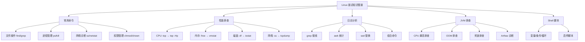

# Linux 面试指南

## 面试知识图谱



## 高频面试题汇总

### 🔥🔥🔥 必问题

#### Q1: 线上 Java 应用 CPU 飙高，如何排查？

**追问链路**：top 定位进程 → top -Hp 定位线程 → 十六进制转换 → jstack 查堆栈 → 常见原因 → Arthas

详见 [JVM 线上问题排查](./05-jvm-troubleshooting.md#一cpu-飙高排查流程)

#### Q2: 线上 Java 应用发生 OOM，如何排查？

**追问链路**：OOM 类型 → jmap 查看堆 → dump 文件 → MAT 分析 → 预设参数 → 常见原因

详见 [JVM 线上问题排查](./05-jvm-troubleshooting.md#二oom内存溢出排查流程)

#### Q3: 如何查看某个端口被哪个进程占用？

**标准答案**：

```bash
lsof -i :8080
# 或
ss -tlnp | grep 8080
# 或
netstat -tlnp | grep 8080
```

#### Q4: 如何实时查看日志并过滤关键字？

**标准答案**：

```bash
tail -f app.log | grep ERROR
# 或查看最后 1000 行并持续追踪
tail -n 1000 -f app.log | grep --line-buffered ERROR
```

#### Q5: 如何统计日志中访问量 Top 10 的 IP？

**标准答案**：

```bash
awk '{print $1}' access.log | sort | uniq -c | sort -rn | head -10
```

### 🔥🔥 常问题

#### Q6: 如何查找大于 100M 的文件？

**标准答案**：

```bash
find / -type f -size +100M -exec ls -lh {} \;
```

#### Q7: 如何查看系统负载？load average 怎么看？

**标准答案**：

`uptime` 或 `top` 查看 load average，显示 1/5/15 分钟的平均负载。load average 表示系统中处于可运行状态和不可中断状态的平均进程数。一般来说，load average 不应超过 CPU 核心数。例如 4 核 CPU，load average 持续超过 4 说明系统过载。

#### Q8: 如何排查线程死锁？

**标准答案**：

```bash
jstack PID > /tmp/thread_dump.txt
grep -A 20 "Found one Java-level deadlock" /tmp/thread_dump.txt
# 或使用 Arthas
thread -b
```

详见 [JVM 线上问题排查](./05-jvm-troubleshooting.md#三线程死锁排查流程)

#### Q9: chmod 755 是什么意思？

**标准答案**：

755 表示所有者有读写执行权限（7=rwx），同组用户有读和执行权限（5=r-x），其他用户有读和执行权限（5=r-x）。数字计算：r=4, w=2, x=1，相加得到权限数字。

#### Q10: 如何后台运行 Java 应用？

**标准答案**：

```bash
nohup java -jar app.jar > app.log 2>&1 &
```

`nohup` 防止终端关闭后进程被杀，`> app.log` 重定向标准输出，`2>&1` 将标准错误也重定向到标准输出，`&` 后台运行。

### 🔥 偶尔问

#### Q11: 硬链接和软链接的区别？

**标准答案**：

硬链接是文件的另一个名字，和原文件共享同一个 inode，删除原文件不影响硬链接。软链接（符号链接）类似快捷方式，存储的是目标文件的路径，删除原文件后软链接失效。硬链接不能跨文件系统，不能链接目录；软链接可以。

#### Q12: /proc 目录是什么？

**标准答案**：

`/proc` 是虚拟文件系统，不占用磁盘空间，提供内核和进程信息的接口。常用文件：`/proc/cpuinfo`（CPU 信息）、`/proc/meminfo`（内存信息）、`/proc/PID/`（进程信息）、`/proc/PID/fd/`（进程打开的文件描述符）。

## 面试答题技巧

1. **CPU 飙高排查**是 Linux 面试的必考题，四步命令序列必须背熟
2. **OOM 排查**要能说出完整流程，强调预设 HeapDumpOnOutOfMemoryError 参数
3. 回答命令题时，给出多种方法体现知识面（如 lsof / ss / netstat 三种查端口）
4. **grep/awk/sed** 组合使用是加分项，能写出统计命令说明实战经验丰富
5. 提到 **Arthas** 体现你了解现代诊断工具，不只是传统的 jstack/jmap
