# AI 应用模块概述

## 概念说明

AI 正在深刻改变软件开发的方式。对于 Java 后端开发者，掌握 LLM（大语言模型）集成、RAG（检索增强生成）、向量数据库和 AI Agent 等技术，是跟上技术趋势的关键。本模块聚焦 Java 生态中的 AI 应用开发，以 Spring AI 框架为主线，覆盖从 API 调用到 Agent 开发的完整技术栈。

## 模块知识图谱

```mermaid
graph TD
    A["Java AI 应用开发"] --> B["Spring AI 框架"]
    A --> C["LLM 集成"]
    A --> D["RAG 检索增强生成"]
    A --> E["向量数据库"]
    A --> F["Prompt Engineering"]
    A --> G["AI Agent"]

    B --> B1["ChatClient"]
    B --> B2["Embedding"]
    B --> B3["VectorStore"]
    B --> B4["Prompt 模板"]

    C --> C1["OpenAI API"]
    C --> C2["国内大模型 API"]
    C --> C3["流式响应"]
    C --> C4["Token 计费"]

    D --> D1["文档加载"]
    D --> D2["文本分块"]
    D --> D3["向量化"]
    D --> D4["相似度检索"]
    D --> D5["生成回答"]

    E --> E1["Milvus"]
    E --> E2["Chroma"]
    E --> E3["PGVector"]

    F --> F1["Few-shot"]
    F --> F2["Chain-of-Thought"]
    F --> F3["角色设定"]

    G --> G1["Function Calling"]
    G --> G2["Tool Use"]
    G --> G3["ReAct 模式"]

    style A fill:#e1f5fe
    style B fill:#e8f5e9
    style C fill:#fff3e0
    style D fill:#fce4ec
    style E fill:#f3e5f5
    style F fill:#e0f2f1
    style G fill:#fff9c4
```

## 推荐学习顺序

| 序号 | 知识点 | 文档 | 建议时间 |
|------|--------|------|----------|
| 1 | Spring AI 框架 | [01-spring-ai](./01-spring-ai.md) | 40min |
| 2 | LLM API 集成 | [02-llm-integration](./02-llm-integration.md) | 35min |
| 3 | RAG 检索增强生成 | [03-rag](./03-rag.md) | 45min |
| 4 | 向量数据库集成 | [04-vector-db](./04-vector-db.md) | 35min |
| 5 | Prompt Engineering | [05-prompt](./05-prompt.md) | 30min |
| 6 | AI Agent 开发 | [06-agent](./06-agent.md) | 40min |
| 7 | 框架对比 | [07-comparison](./07-comparison.md) | 20min |
| 8 | 面试指南 | [99-interview](./99-interview.md) | 25min |

## 代码示例

本模块的代码示例位于 `code-examples/07-ai/ai-examples/`，包含：

| 代码包 | 内容 |
|--------|------|
| chat/ | LLM API 调用模拟、流式响应 |
| rag/ | RAG 流程模拟（分块→向量化→检索→生成） |
| prompt/ | Prompt 模板管理、Few-shot 示例 |
| agent/ | Function Calling 模拟 |

> ⚠️ 代码示例不依赖实际 LLM API，用模拟方式演示核心逻辑，可直接运行。

## 相关模块

- [Spring Boot](../../2-framework/2.2-springboot/) — Spring Boot 应用开发基础
- [Elasticsearch](../../3-data-store/3.3-elasticsearch/) — 全文检索（与向量检索对比）
- [Redis](../../3-data-store/3.2-redis/) — 缓存 LLM 响应
