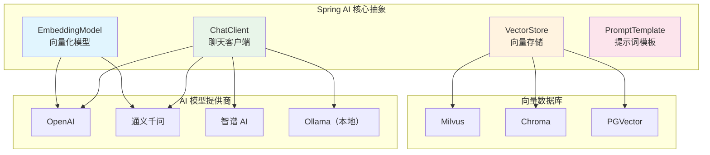
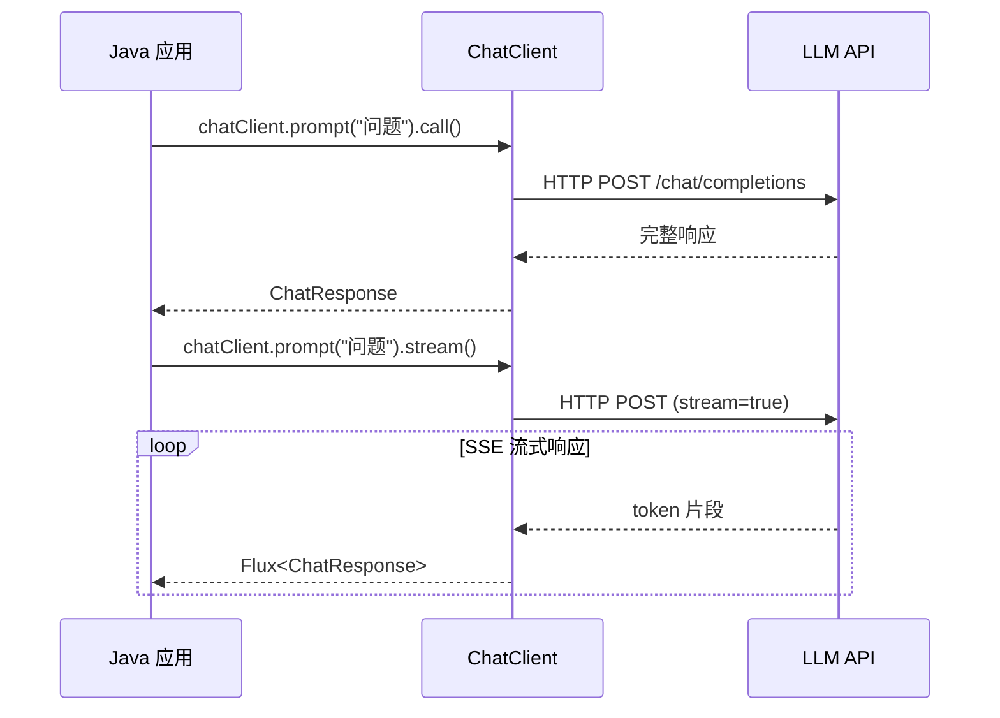

# Spring AI 框架

## 概念说明

Spring AI 是 Spring 官方推出的 AI 集成框架，为 Java 开发者提供了统一的 API 来对接各种 AI 模型和服务。它遵循 Spring 的设计哲学——提供可移植的抽象层，让开发者可以在不同 AI 提供商之间轻松切换。

## 核心原理

### Spring AI 架构



### 核心组件

| 组件 | 说明 | 类比 |
|------|------|------|
| ChatClient | 与 LLM 对话的客户端 | 类似 RestTemplate |
| ChatModel | 聊天模型抽象 | 类似 DataSource |
| EmbeddingModel | 文本向量化模型 | 将文本转为数值向量 |
| VectorStore | 向量存储和检索 | 类似 JPA Repository |
| PromptTemplate | 提示词模板 | 类似 Thymeleaf 模板 |
| OutputParser | 输出解析器 | 将 LLM 输出转为 Java 对象 |

### ChatClient 流式 API



## 代码示例

### ChatClient 基本使用（模拟）

```java
/**
 * 模拟 Spring AI ChatClient 的核心用法
 * 不依赖实际 LLM API，演示核心概念
 */
public class ChatDemo {

    // 模拟 ChatClient 调用
    public static String chat(String userMessage) {
        // 实际使用 Spring AI 时：
        // return chatClient.prompt()
        //     .user(userMessage)
        //     .call()
        //     .content();

        // 模拟响应
        return simulateResponse(userMessage);
    }

    // 模拟流式响应
    public static List<String> streamChat(String userMessage) {
        // 实际使用 Spring AI 时：
        // return chatClient.prompt()
        //     .user(userMessage)
        //     .stream()
        //     .content()
        //     .collectList()
        //     .block();

        return simulateStreamResponse(userMessage);
    }
}
```

### Spring Boot 集成配置

```yaml
# application.yml（实际项目配置参考）
spring:
  ai:
    openai:
      api-key: ${OPENAI_API_KEY}
      chat:
        options:
          model: gpt-4
          temperature: 0.7
          max-tokens: 2000
    # 或使用国内模型
    # zhipuai:
    #   api-key: ${ZHIPU_API_KEY}
```

> 💻 完整代码示例：[code-examples/07-ai/ai-examples/src/main/java/com/example/ai/chat/ChatDemo.java](../../../code-examples/07-ai/ai-examples/src/main/java/com/example/ai/chat/ChatDemo.java)

## 常见面试题

### Q1: Spring AI 是什么？它解决了什么问题？

**难度**：⭐⭐ | **频率**：🔥🔥

**标准答案**：

Spring AI 是 Spring 官方的 AI 集成框架，提供统一的抽象层来对接各种 AI 模型（OpenAI、通义千问、智谱等）。它解决了：①不同 AI 提供商 API 不统一的问题，通过 ChatClient 等抽象实现可移植性；②简化了 RAG、向量存储等复杂流程的开发；③与 Spring Boot 生态无缝集成（自动配置、依赖注入）。核心组件包括 ChatClient（对话）、EmbeddingModel（向量化）、VectorStore（向量存储）和 PromptTemplate（提示词模板）。

**深入追问**：

- Spring AI 和 LangChain4j 有什么区别？
- 如何在 Spring AI 中切换不同的 AI 提供商？

## 参考资料

- [Spring AI 官方文档](https://docs.spring.io/spring-ai/reference/)
