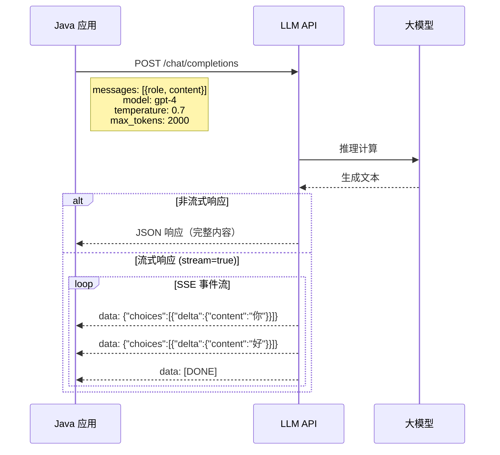
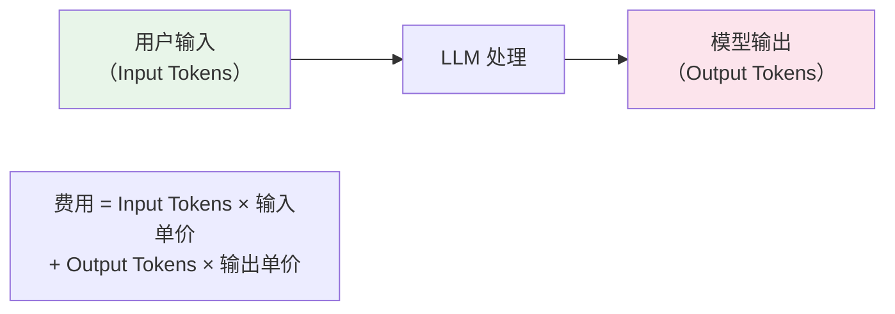

# LLM API 集成

## 概念说明

LLM（Large Language Model，大语言模型）是 AI 应用的核心引擎。Java 后端开发者需要掌握如何通过 API 调用 LLM，处理流式响应，以及理解 Token 计费模型。本文覆盖 OpenAI 和国内主流大模型的 API 集成方式。

## 核心原理

### LLM API 调用流程



### 主流 LLM API 对比

| 模型 | 提供商 | API 兼容性 | 特点 |
|------|--------|-----------|------|
| GPT-4 / GPT-3.5 | OpenAI | 标准 | 综合能力最强 |
| 通义千问 | 阿里云 | 兼容 OpenAI | 中文能力强 |
| 智谱 GLM-4 | 智谱 AI | 兼容 OpenAI | 性价比高 |
| 文心一言 | 百度 | 自有 API | 中文理解好 |
| DeepSeek | DeepSeek | 兼容 OpenAI | 代码能力强 |

### Token 计费模型



Token 估算规则：
- 英文：约 1 token ≈ 4 个字符 ≈ 0.75 个单词
- 中文：约 1 token ≈ 1-2 个汉字

## 代码示例

### 模拟 LLM API 调用

```java
/**
 * 模拟 LLM API 调用核心逻辑
 * 演示请求构建、响应解析、流式处理
 */
public class ChatDemo {

    // 模拟同步调用
    public static ChatResponse chat(String model, List<Message> messages) {
        // 构建请求
        ChatRequest request = new ChatRequest(model, messages, 0.7, 2000);

        // 模拟 API 调用
        String content = processRequest(request);

        // 构建响应（包含 token 使用统计）
        return new ChatResponse(content,
            new Usage(countTokens(messages), countTokens(content)));
    }

    // 模拟流式调用
    public static void streamChat(String userMessage, Consumer<String> onToken) {
        String fullResponse = "这是一个模拟的流式响应示例";
        for (char c : fullResponse.toCharArray()) {
            onToken.accept(String.valueOf(c));
            sleep(50); // 模拟逐字输出
        }
    }
}
```

> 💻 完整代码示例：[code-examples/07-ai/ai-examples/src/main/java/com/example/ai/chat/ChatDemo.java](../../../code-examples/07-ai/ai-examples/src/main/java/com/example/ai/chat/ChatDemo.java)

## 常见面试题

### Q1: 如何在 Java 中集成 LLM API？

**难度**：⭐⭐ | **频率**：🔥🔥

**标准答案**：

Java 集成 LLM API 主要有两种方式：①使用 Spring AI 框架，通过 ChatClient 抽象统一对接各种模型，支持自动配置和依赖注入；②直接使用 HTTP 客户端（如 RestTemplate/WebClient）调用 REST API。关键要点：使用流式响应（SSE）提升用户体验、合理设置 temperature 和 max_tokens 参数、做好 Token 用量监控和限流、处理 API 超时和重试。

### Q2: 什么是流式响应？为什么 LLM 要用流式响应？

**难度**：⭐⭐ | **频率**：🔥🔥

**标准答案**：

流式响应（Streaming）是指 LLM 在生成文本的过程中，逐个 Token 通过 SSE（Server-Sent Events）推送给客户端，而不是等全部生成完再返回。好处：①用户体验好，首字延迟低（几百毫秒 vs 几秒）；②可以实现打字机效果；③长文本生成时不会超时。实现方式是在请求中设置 `stream=true`，客户端通过 SSE 或 WebSocket 接收。

## 参考资料

- [OpenAI API 文档](https://platform.openai.com/docs/api-reference)
