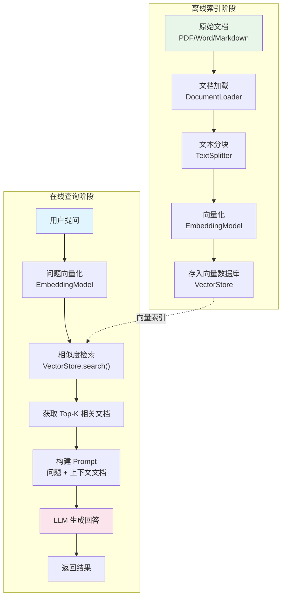
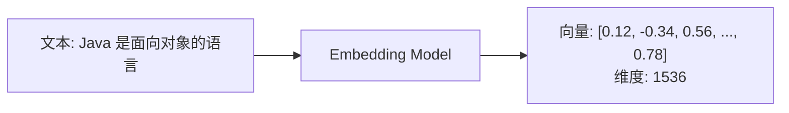

# RAG 检索增强生成

## 概念说明

RAG（Retrieval-Augmented Generation，检索增强生成）是当前最实用的 AI 应用模式。它通过在 LLM 生成回答之前，先从知识库中检索相关文档作为上下文，解决了 LLM 的知识截止、幻觉和领域知识不足等问题。

## 核心原理

### RAG 完整流程



### 关键步骤详解

#### 1. 文本分块策略

| 策略 | 说明 | 适用场景 |
|------|------|----------|
| 固定大小分块 | 按字符数切分，设置重叠区域 | 通用场景 |
| 按段落分块 | 按自然段落切分 | 结构化文档 |
| 递归分块 | 先按大分隔符切，再递归细分 | 长文档 |
| 语义分块 | 按语义相似度切分 | 高质量要求 |

```
原始文本: "Java 是一种面向对象的编程语言。它具有跨平台特性..."

分块参数: chunkSize=500, overlap=50

块1: "Java 是一种面向对象的编程语言。它具有跨平台特性...（前500字）"
块2: "...跨平台特性。Java 的内存管理...（重叠50字 + 后续内容）"
```

#### 2. 向量化（Embedding）



#### 3. 相似度检索

| 算法 | 公式 | 特点 |
|------|------|------|
| 余弦相似度 | cos(A,B) = A·B / (‖A‖×‖B‖) | 最常用，不受向量长度影响 |
| 欧氏距离 | d = √Σ(ai-bi)² | 对绝对距离敏感 |
| 内积 | A·B = Σ(ai×bi) | 计算最快 |

## 代码示例

### RAG 流程模拟

```java
/**
 * RAG 流程模拟：文档分块 → 向量化 → 检索 → 生成
 */
public class RAGDemo {

    // 1. 文本分块
    public static List<String> splitText(String text, int chunkSize, int overlap) {
        List<String> chunks = new ArrayList<>();
        for (int i = 0; i < text.length(); i += chunkSize - overlap) {
            int end = Math.min(i + chunkSize, text.length());
            chunks.add(text.substring(i, end));
            if (end == text.length()) break;
        }
        return chunks;
    }

    // 2. 模拟向量化
    public static double[] embed(String text) {
        // 实际使用 EmbeddingModel.embed(text)
        // 这里用简单哈希模拟
        double[] vector = new double[8];
        for (int i = 0; i < vector.length; i++) {
            vector[i] = (text.hashCode() * (i + 1)) % 100 / 100.0;
        }
        return vector;
    }

    // 3. 余弦相似度计算
    public static double cosineSimilarity(double[] a, double[] b) {
        double dotProduct = 0, normA = 0, normB = 0;
        for (int i = 0; i < a.length; i++) {
            dotProduct += a[i] * b[i];
            normA += a[i] * a[i];
            normB += b[i] * b[i];
        }
        return dotProduct / (Math.sqrt(normA) * Math.sqrt(normB));
    }

    // 4. 检索 Top-K 相关文档
    public static List<String> search(String query, List<String> docs, int topK) {
        double[] queryVec = embed(query);
        return docs.stream()
            .sorted((a, b) -> Double.compare(
                cosineSimilarity(embed(b), queryVec),
                cosineSimilarity(embed(a), queryVec)))
            .limit(topK)
            .collect(Collectors.toList());
    }
}
```

> 💻 完整代码示例：[code-examples/07-ai/ai-examples/src/main/java/com/example/ai/rag/RAGDemo.java](https://github.com/skyhe58/guide-java/tree/main/code-examples/07-ai/ai-examples/src/main/java/com/example/ai/rag/RAGDemo.java)
> <!-- 本地路径：code-examples/07-ai/ai-examples/src/main/java/com/example/ai/rag/RAGDemo.java -->

## 常见面试题

### Q1: 什么是 RAG？它解决了什么问题？

**难度**：⭐⭐⭐ | **频率**：🔥🔥🔥

**答题思路**：

1. 解释 RAG 的含义和动机
2. 描述完整流程
3. 说明解决的问题

**标准答案**：

RAG（检索增强生成）是在 LLM 生成回答之前，先从外部知识库中检索相关文档作为上下文的技术。完整流程：离线阶段将文档分块→向量化→存入向量数据库；在线阶段将用户问题向量化→检索相似文档→将文档作为上下文拼入 Prompt→LLM 生成回答。RAG 解决了三个核心问题：①知识截止（LLM 训练数据有时效性）；②幻觉（LLM 可能编造事实）；③领域知识不足（企业私有知识 LLM 不知道）。

**深入追问**：

- 文本分块的策略有哪些？chunk size 如何选择？
- 如何评估 RAG 系统的效果？
- RAG 和 Fine-tuning 的区别和适用场景？

## 参考资料

- [RAG 论文](https://arxiv.org/abs/2005.11401)
- [Spring AI RAG 文档](https://docs.spring.io/spring-ai/reference/api/retrieval-augmented-generation.html)
