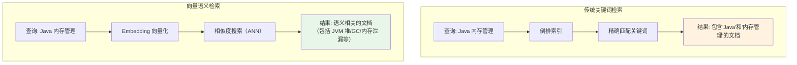
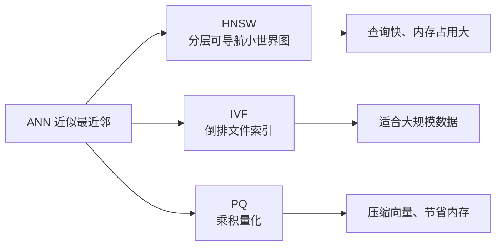

# 向量数据库集成

## 概念说明

向量数据库是专门用于存储和检索高维向量的数据库。在 AI 应用中，文本通过 Embedding 模型转换为向量后存入向量数据库，查询时通过相似度搜索找到语义最相近的内容。它是 RAG 系统的核心基础设施。

## 核心原理

### 向量检索 vs 传统检索



| 对比项 | 关键词检索 | 向量语义检索 |
|--------|-----------|-------------|
| 匹配方式 | 精确匹配关键词 | 语义相似度匹配 |
| 同义词处理 | 需要手动配置 | 自动理解语义 |
| 跨语言 | 不支持 | 支持（多语言模型） |
| 索引结构 | 倒排索引 | ANN 索引（HNSW/IVF） |
| 适用场景 | 精确搜索 | 语义搜索、推荐 |

### 主流向量数据库对比

| 数据库 | 类型 | 特点 | 适用场景 |
|--------|------|------|----------|
| Milvus | 专用向量数据库 | 高性能、分布式、支持十亿级向量 | 大规模生产环境 |
| Chroma | 轻量级向量数据库 | 简单易用、内嵌模式 | 原型开发、小规模应用 |
| PGVector | PostgreSQL 扩展 | 复用现有 PG 基础设施 | 已有 PG 的项目 |
| Elasticsearch | 搜索引擎 + 向量 | 混合检索（关键词+向量） | 需要混合检索的场景 |
| Redis Stack | 缓存 + 向量 | 低延迟 | 实时推荐 |

### ANN 索引算法



## 代码示例

### 模拟向量存储与检索

```java
/**
 * 模拟向量数据库的核心操作
 * 演示向量存储、相似度搜索
 */
public class VectorStoreDemo {

    private final Map<String, double[]> store = new HashMap<>();

    // 存储文档向量
    public void add(String docId, String text, double[] vector) {
        store.put(docId, vector);
    }

    // 相似度搜索
    public List<String> search(double[] queryVector, int topK) {
        return store.entrySet().stream()
            .sorted((a, b) -> Double.compare(
                cosineSimilarity(b.getValue(), queryVector),
                cosineSimilarity(a.getValue(), queryVector)))
            .limit(topK)
            .map(Map.Entry::getKey)
            .collect(Collectors.toList());
    }
}
```

> 💻 完整代码示例：[code-examples/07-ai/ai-examples/src/main/java/com/example/ai/rag/RAGDemo.java](../../../code-examples/07-ai/ai-examples/src/main/java/com/example/ai/rag/RAGDemo.java)

## 常见面试题

### Q1: 向量数据库和传统数据库有什么区别？

**难度**：⭐⭐ | **频率**：🔥🔥

**标准答案**：

传统数据库（如 MySQL）基于精确匹配查询，使用 B+树索引；向量数据库专门存储高维向量，基于相似度搜索，使用 ANN（近似最近邻）索引算法如 HNSW。向量数据库的核心能力是语义搜索——即使查询词和文档用词不同，只要语义相近就能匹配到。在 AI 应用中，文本通过 Embedding 模型转为向量后存入向量数据库，实现语义级别的检索。

**深入追问**：

- HNSW 索引的原理是什么？
- 如何选择向量数据库？

## 参考资料

- [Milvus 文档](https://milvus.io/docs)
- [PGVector](https://github.com/pgvector/pgvector)
