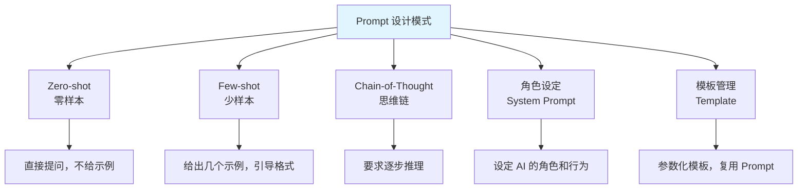
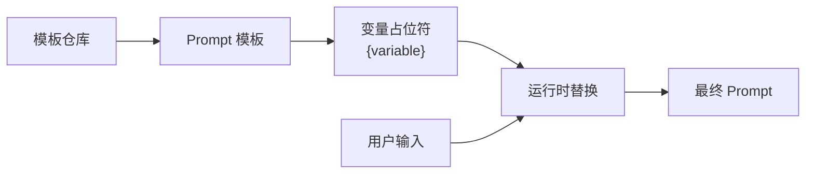

# Prompt Engineering

## 概念说明

Prompt Engineering（提示词工程）是通过精心设计输入提示词来引导 LLM 生成高质量输出的技术。好的 Prompt 可以显著提升 LLM 的回答质量、准确性和一致性。对于 Java 后端开发者，掌握 Prompt 设计是构建 AI 应用的基本功。

## 核心原理

### Prompt 设计模式



### Few-shot 示例

```
你是一个 Java 代码审查助手。请按以下格式审查代码：

示例 1：
代码：String s = new String("hello");
审查：⚠️ 不推荐。直接使用字符串字面量 "hello" 即可，避免创建多余的 String 对象。

示例 2：
代码：if (list.size() > 0) { ... }
审查：💡 建议使用 !list.isEmpty() 替代 list.size() > 0，语义更清晰。

现在请审查以下代码：
代码：{user_code}
```

### Chain-of-Thought（思维链）

```
请分析以下 Java 代码的时间复杂度，请一步步推理：

代码：
for (int i = 0; i < n; i++) {
    for (int j = i; j < n; j++) {
        // O(1) 操作
    }
}

请按以下步骤分析：
1. 外层循环执行次数
2. 内层循环在每次外层迭代中的执行次数
3. 总执行次数的数学表达式
4. 最终时间复杂度
```

### Prompt 模板管理



## 代码示例

### Prompt 模板管理

```java
/**
 * Prompt 模板管理器
 * 支持变量替换和模板复用
 */
public class PromptDemo {

    // 模板定义
    private static final String CODE_REVIEW_TEMPLATE = """
        你是一个资深 Java 代码审查专家。
        请审查以下代码，指出潜在问题和改进建议。

        代码语言：{language}
        代码内容：
        ```
        {code}
        ```

        请按以下格式输出：
        1. 问题描述
        2. 严重程度（高/中/低）
        3. 改进建议
        """;

    // 模板渲染
    public static String render(String template, Map<String, String> variables) {
        String result = template;
        for (Map.Entry<String, String> entry : variables.entrySet()) {
            result = result.replace("{" + entry.getKey() + "}", entry.getValue());
        }
        return result;
    }
}
```

> 💻 完整代码示例：[code-examples/07-ai/ai-examples/src/main/java/com/example/ai/prompt/PromptDemo.java](https://github.com/skyhe58/guide-java/tree/main/code-examples/07-ai/ai-examples/src/main/java/com/example/ai/prompt/PromptDemo.java)
> <!-- 本地路径：code-examples/07-ai/ai-examples/src/main/java/com/example/ai/prompt/PromptDemo.java -->

## 常见面试题

### Q1: 什么是 Prompt Engineering？有哪些常用技巧？

**难度**：⭐⭐ | **频率**：🔥🔥

**标准答案**：

Prompt Engineering 是通过设计输入提示词来引导 LLM 生成高质量输出的技术。常用技巧：①角色设定（System Prompt）：给 LLM 设定专业角色；②Few-shot：提供几个输入输出示例，引导格式和风格；③Chain-of-Thought：要求 LLM 逐步推理，提升复杂问题的准确性；④输出格式约束：指定 JSON/Markdown 等输出格式；⑤模板管理：将 Prompt 参数化，支持变量替换和复用。

**深入追问**：

- Few-shot 和 Zero-shot 的区别？什么时候用哪个？
- 如何评估 Prompt 的效果？

## 参考资料

- [OpenAI Prompt Engineering Guide](https://platform.openai.com/docs/guides/prompt-engineering)
