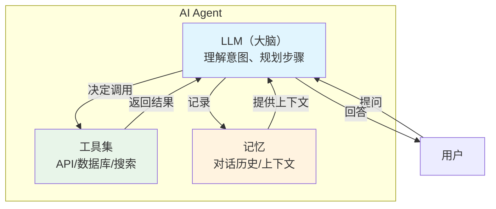
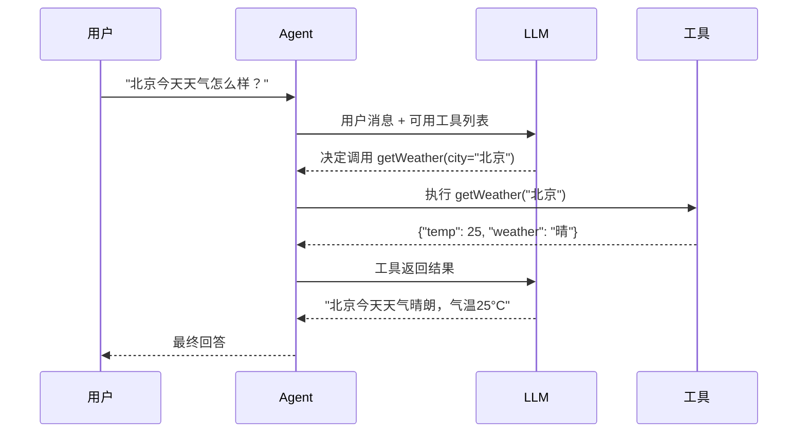
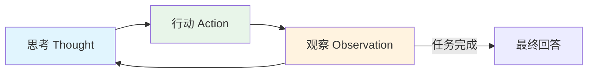
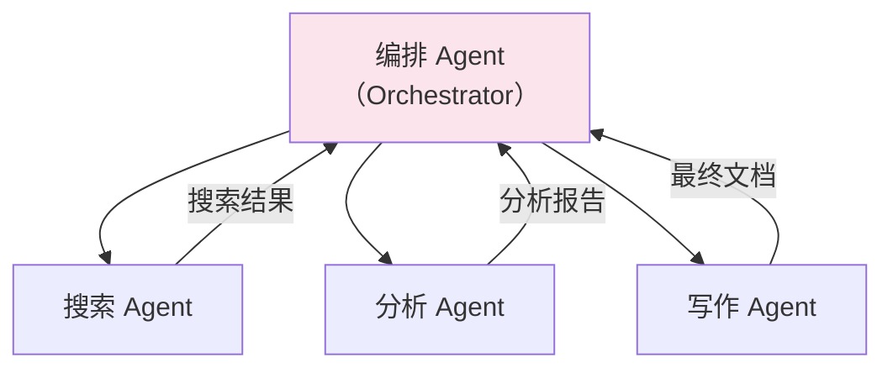

# AI Agent 开发

## 概念说明

AI Agent 是能够自主决策和执行任务的智能体。与简单的 LLM 对话不同，Agent 可以调用外部工具（API、数据库、搜索引擎等）来完成复杂任务。Function Calling 是实现 Agent 的核心技术，让 LLM 能够"调用函数"。

## 核心原理

### Agent 架构



### Function Calling 流程



### ReAct 模式

ReAct（Reasoning + Acting）是一种让 Agent 交替进行推理和行动的模式：



```
Thought: 用户问北京天气，我需要调用天气 API
Action: getWeather(city="北京")
Observation: {"temp": 25, "weather": "晴"}
Thought: 已获取天气信息，可以回答用户
Answer: 北京今天天气晴朗，气温25°C，适合出行。
```

### 多 Agent 协作



## 代码示例

### Function Calling 模拟

```java
/**
 * 模拟 AI Agent 的 Function Calling 机制
 * 演示工具注册、意图识别、工具调用
 */
public class AgentDemo {

    // 工具注册表
    private final Map<String, Function<Map<String, String>, String>> tools = new HashMap<>();

    // 注册工具
    public void registerTool(String name, Function<Map<String, String>, String> handler) {
        tools.put(name, handler);
    }

    // 模拟 Agent 处理流程
    public String process(String userMessage) {
        // 1. 意图识别（模拟 LLM 判断是否需要调用工具）
        String toolName = identifyTool(userMessage);

        if (toolName != null && tools.containsKey(toolName)) {
            // 2. 提取参数
            Map<String, String> params = extractParams(userMessage);
            // 3. 调用工具
            String toolResult = tools.get(toolName).apply(params);
            // 4. 基于工具结果生成回答
            return generateAnswer(userMessage, toolResult);
        }

        // 不需要工具，直接回答
        return directAnswer(userMessage);
    }
}
```

> 💻 完整代码示例：[code-examples/07-ai/ai-examples/src/main/java/com/example/ai/agent/AgentDemo.java](../../../code-examples/07-ai/ai-examples/src/main/java/com/example/ai/agent/AgentDemo.java)

## 常见面试题

### Q1: 什么是 AI Agent？和普通 LLM 对话有什么区别？

**难度**：⭐⭐⭐ | **频率**：🔥🔥

**标准答案**：

AI Agent 是能够自主决策和执行任务的智能体，核心区别在于 Agent 可以调用外部工具。普通 LLM 对话只能基于训练数据生成文本，无法获取实时信息或执行操作。Agent 通过 Function Calling 机制，让 LLM 判断何时需要调用什么工具，获取工具返回结果后再生成最终回答。常见的 Agent 模式有 ReAct（推理+行动交替）和多 Agent 协作。

**深入追问**：

- Function Calling 的原理是什么？
- ReAct 模式和 Plan-and-Execute 模式的区别？

## 参考资料

- [ReAct 论文](https://arxiv.org/abs/2210.03629)
- [OpenAI Function Calling](https://platform.openai.com/docs/guides/function-calling)
