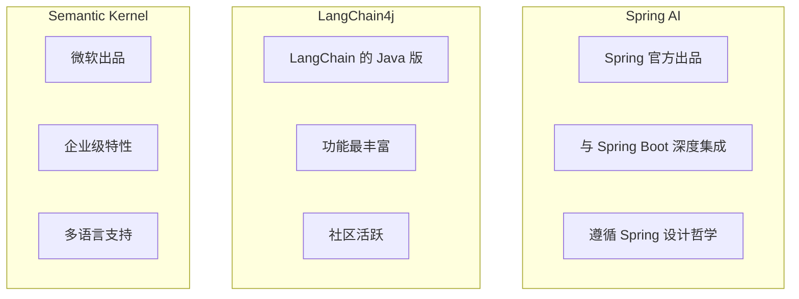
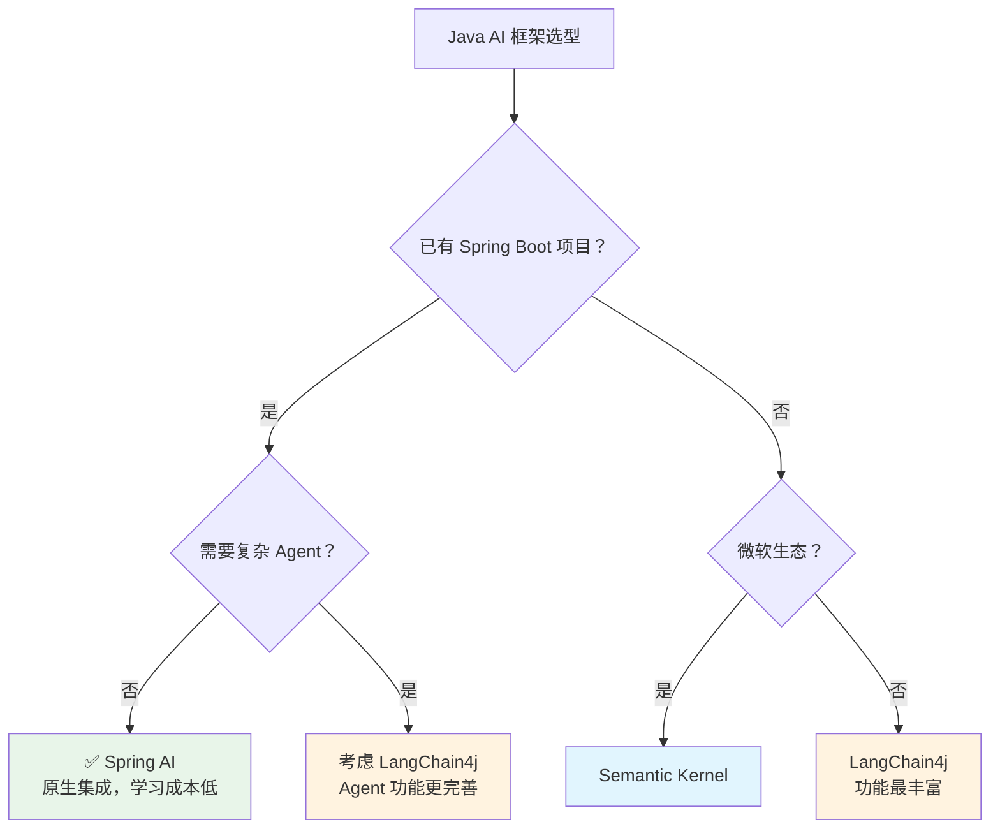

# AI 框架对比：Spring AI vs LangChain4j vs Semantic Kernel

## 概念说明

Java 生态中有多个 AI 集成框架可供选择。本文对比三个主流框架的特点、优劣和适用场景，帮助开发者做出合理选型。

## 核心对比

### 框架概览



### 详细对比表

| 对比维度 | Spring AI | LangChain4j | Semantic Kernel |
|----------|-----------|-------------|-----------------|
| 维护方 | Spring 官方 | 社区 | 微软 |
| 成熟度 | 较新（2023年底） | 较成熟 | 较成熟 |
| Spring 集成 | 原生支持 | 需要适配 | 需要适配 |
| 模型支持 | OpenAI/Ollama/多家 | 最广泛 | OpenAI/Azure |
| RAG 支持 | ✅ 内置 | ✅ 功能丰富 | ✅ 支持 |
| Agent 支持 | 基础支持 | ✅ 完善 | ✅ 完善 |
| 向量数据库 | 多种支持 | 多种支持 | 多种支持 |
| 文档质量 | 良好 | 良好 | 良好 |
| 学习曲线 | 低（Spring 开发者） | 中等 | 中等 |
| 适用场景 | Spring Boot 项目 | 功能需求复杂 | 微软生态项目 |

### 选型建议



### 代码风格对比

#### Spring AI

```java
@RestController
public class ChatController {
    private final ChatClient chatClient;

    public ChatController(ChatClient.Builder builder) {
        this.chatClient = builder.build();
    }

    @GetMapping("/chat")
    public String chat(@RequestParam String message) {
        return chatClient.prompt()
            .user(message)
            .call()
            .content();
    }
}
```

#### LangChain4j

```java
// LangChain4j 风格
interface Assistant {
    @SystemMessage("你是一个 Java 专家")
    String chat(String message);
}

Assistant assistant = AiServices.builder(Assistant.class)
    .chatLanguageModel(model)
    .build();

String answer = assistant.chat("什么是 Spring Boot？");
```

## 常见面试题

### Q1: Java 生态中有哪些 AI 框架？如何选型？

**难度**：⭐⭐ | **频率**：🔥

**标准答案**：

Java 生态主要有三个 AI 框架：①Spring AI — Spring 官方出品，与 Spring Boot 原生集成，学习成本低，适合 Spring 项目；②LangChain4j — LangChain 的 Java 版，功能最丰富，Agent 和 RAG 支持完善，适合复杂 AI 应用；③Semantic Kernel — 微软出品，适合微软生态项目。选型建议：Spring Boot 项目优先选 Spring AI；需要复杂 Agent 功能选 LangChain4j。

## 参考资料

- [Spring AI](https://docs.spring.io/spring-ai/reference/)
- [LangChain4j](https://docs.langchain4j.dev/)
- [Semantic Kernel](https://learn.microsoft.com/en-us/semantic-kernel/)
