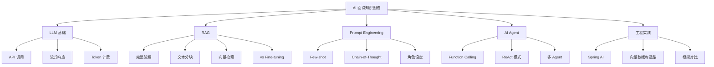
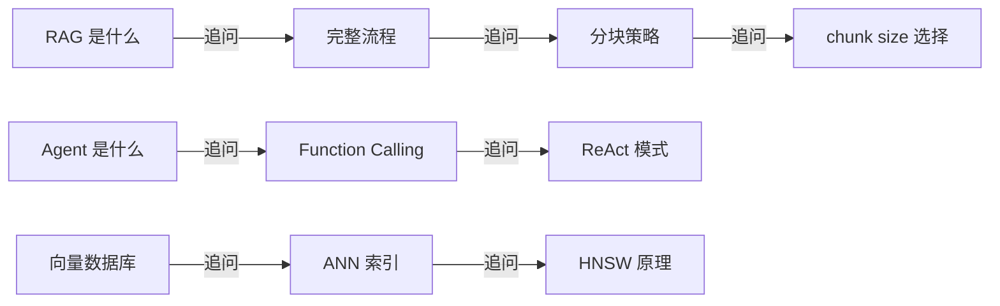

# AI 面试指南

## 面试知识图谱

## 高频面试题汇总

### 🔥🔥🔥 必问题

#### Q1: 什么是 RAG？它解决了什么问题？

详见 [RAG 检索增强生成](./03-rag.md)

**核心要点**：检索增强生成，离线索引（分块→向量化→存储）+ 在线查询（检索→拼接上下文→LLM 生成）。解决知识截止、幻觉、领域知识不足。

#### Q2: RAG 和 Fine-tuning 的区别？什么时候用哪个？

**核心要点**：

| 对比 | RAG | Fine-tuning |
|------|-----|-------------|
| 原理 | 检索外部知识作为上下文 | 在特定数据上继续训练模型 |
| 知识更新 | 实时（更新知识库即可） | 需要重新训练 |
| 成本 | 低（只需向量数据库） | 高（GPU 训练） |
| 适用场景 | 知识问答、文档检索 | 风格适配、特定任务优化 |
| 推荐 | 大多数场景优先选 RAG | 需要改变模型行为时 |

#### Q3: 什么是 AI Agent？和普通 LLM 对话有什么区别？

详见 [AI Agent 开发](./06-agent.md)

**核心要点**：Agent 可以调用外部工具（Function Calling），自主决策和执行任务。普通对话只能基于训练数据生成文本。

### 🔥🔥 常问题

#### Q4: Prompt Engineering 有哪些常用技巧？

详见 [Prompt Engineering](./05-prompt.md)

**核心要点**：角色设定、Few-shot、Chain-of-Thought、输出格式约束、模板管理。

#### Q5: 向量数据库和传统数据库有什么区别？

详见 [向量数据库集成](./04-vector-db.md)

**核心要点**：向量数据库基于相似度搜索（ANN 索引），支持语义检索；传统数据库基于精确匹配（B+树索引）。

#### Q6: Java 生态中有哪些 AI 框架？

详见 [框架对比](./07-comparison.md)

**核心要点**：Spring AI（Spring 原生）、LangChain4j（功能丰富）、Semantic Kernel（微软）。

### 🔥 偶尔问

#### Q7: 什么是 Function Calling？

详见 [AI Agent 开发](./06-agent.md)

#### Q8: 什么是流式响应？为什么 LLM 要用流式响应？

详见 [LLM API 集成](./02-llm-integration.md)

## 面试追问链路

## 参考资料

- [Spring AI 官方文档](https://docs.spring.io/spring-ai/reference/)
- [RAG 论文](https://arxiv.org/abs/2005.11401)
- [ReAct 论文](https://arxiv.org/abs/2210.03629)
