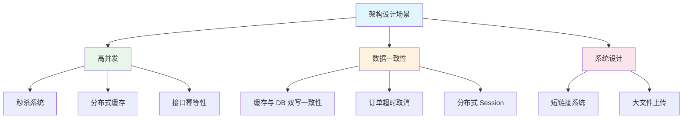

# 架构设计场景模块概述

## 概念说明

架构设计场景是面试中的高频考点，考察候选人综合运用技术解决实际问题的能力。每个场景都涉及多个技术领域的知识，需要从问题分析、方案对比、技术选型到核心实现进行完整的思考。

## 模块知识图谱



## 推荐学习顺序

| 序号 | 场景 | 文档 | 建议时间 | 关联技术 |
|------|------|------|----------|----------|
| 1 | 秒杀系统设计 | [01-seckill](./01-seckill.md) | 60min | Redis + MQ + 限流 |
| 2 | 短链接系统 | [02-short-url](./02-short-url.md) | 40min | 哈希 + 数据库 |
| 3 | 订单超时取消 | [03-order-timeout](./03-order-timeout.md) | 45min | 延迟队列 + Redis |
| 4 | 分布式缓存方案 | [04-cache-strategy](./04-cache-strategy.md) | 45min | Redis + 缓存策略 |
| 5 | 接口幂等性设计 | [05-idempotent-design](./05-idempotent-design.md) | 40min | Token + 分布式锁 |
| 6 | 分布式 Session | [06-distributed-session](./06-distributed-session.md) | 35min | Redis + JWT |
| 7 | 大文件上传 | [07-file-upload](./07-file-upload.md) | 40min | 分片 + 断点续传 |
| 8 | 缓存与 DB 一致性 | [08-cache-db-consistency](./08-cache-db-consistency.md) | 50min | Redis + MQ |
| 9 | 面试指南 | [99-interview](./99-interview.md) | 30min | — |

## 答题框架

面试中回答架构设计题的标准框架：

```
1. 需求分析 — 明确功能需求和非功能需求（QPS/延迟/数据量）
2. 方案对比 — 列出 2-3 种方案，分析优缺点
3. 推荐方案 — 选择最合适的方案并说明理由
4. 核心设计 — 详细说明核心链路的技术实现
5. 常见追问 — 准备好扩展问题的回答
```

## 相关模块

- [Redis](../3-data-store/3.2-redis/01-data-structures.md) — 缓存、分布式锁
- [消息队列](../4-middleware/4.1-mq-rabbitmq/01-rabbitmq.md) — 异步处理、延迟消息
- [分布式系统](../5-distributed/5.1-distributed/01-cap-base.md) — 分布式理论基础
