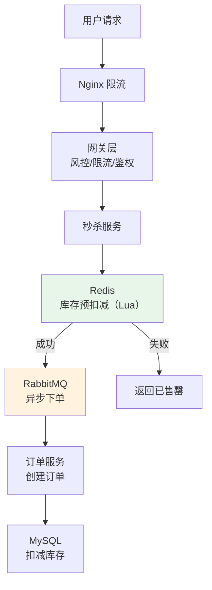
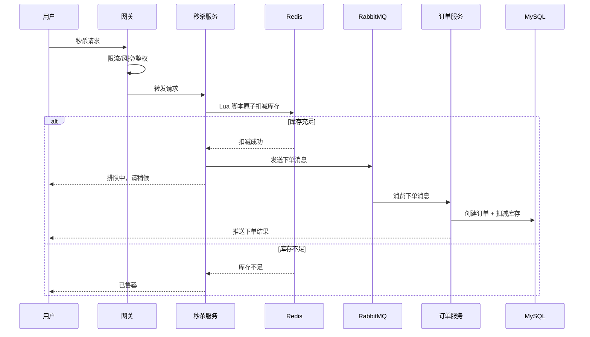

# 秒杀系统设计

## 问题分析

秒杀场景的核心挑战：
- **瞬时高并发**：数万甚至数十万 QPS
- **库存超卖**：并发扣减库存可能导致超卖
- **恶意请求**：刷单、机器人抢购
- **系统稳定性**：不能因秒杀影响正常业务

## 方案对比

| 方案 | 优点 | 缺点 | 适用场景 |
|------|------|------|----------|
| 数据库悲观锁 | 实现简单 | 性能极差，数据库压力大 | 低并发 |
| Redis 预扣减 + MQ | 高性能，异步处理 | 实现复杂 | 高并发秒杀 |
| Redis + Lua 原子操作 | 原子性保证，无超卖 | 需要 Redis 高可用 | 推荐方案 |

## 推荐方案详解

### 整体架构



### 核心流程



### Redis Lua 脚本（原子扣减库存）

```lua
-- seckill.lua
-- KEYS[1]: 库存 key（如 seckill:stock:1001）
-- KEYS[2]: 已购用户集合 key（如 seckill:bought:1001）
-- ARGV[1]: 用户 ID

-- 1. 检查用户是否已购买（防止重复购买）
if redis.call('sismember', KEYS[2], ARGV[1]) == 1 then
    return -2  -- 已购买
end

-- 2. 检查库存
local stock = tonumber(redis.call('get', KEYS[1]))
if stock == nil or stock <= 0 then
    return -1  -- 库存不足
end

-- 3. 扣减库存 + 记录用户
redis.call('decr', KEYS[1])
redis.call('sadd', KEYS[2], ARGV[1])
return 1  -- 成功
```

### 多层限流策略

| 层级 | 方式 | 说明 |
|------|------|------|
| 前端 | 按钮置灰 + 倒计时 | 防止重复点击 |
| CDN | 静态资源缓存 | 减少服务器压力 |
| Nginx | `limit_req` | IP 级别限流 |
| 网关 | Sentinel/令牌桶 | 接口级别限流 |
| 服务 | Redis 判断 | 用户级别限流 |

## 核心代码说明

```java
@Service
public class SeckillService {

    @Autowired
    private StringRedisTemplate redisTemplate;

    @Autowired
    private RabbitTemplate rabbitTemplate;

    private static final DefaultRedisScript<Long> SECKILL_SCRIPT;

    static {
        SECKILL_SCRIPT = new DefaultRedisScript<>();
        SECKILL_SCRIPT.setLocation(new ClassPathResource("seckill.lua"));
        SECKILL_SCRIPT.setResultType(Long.class);
    }

    public SeckillResult seckill(Long productId, Long userId) {
        // 1. Redis Lua 原子扣减库存
        Long result = redisTemplate.execute(SECKILL_SCRIPT,
            List.of("seckill:stock:" + productId, "seckill:bought:" + productId),
            userId.toString());

        if (result == -1) return SeckillResult.SOLD_OUT;
        if (result == -2) return SeckillResult.ALREADY_BOUGHT;

        // 2. 发送异步下单消息
        SeckillMessage message = new SeckillMessage(productId, userId);
        rabbitTemplate.convertAndSend("seckill.exchange", "seckill.order", message);

        return SeckillResult.QUEUING;
    }
}
```

## 常见追问

### Q: 如何防止超卖？
Redis Lua 脚本保证检查库存和扣减库存的原子性。数据库层面使用乐观锁（`UPDATE SET stock=stock-1 WHERE id=? AND stock>0`）作为兜底。

### Q: 如何处理 MQ 消息丢失？
RabbitMQ 开启 Publisher Confirm + 消费者手动 ACK + 消息持久化。订单服务消费失败进入死信队列，人工处理。

### Q: 如何保证用户只能购买一次？
Redis Set 记录已购用户（Lua 脚本中检查），数据库唯一索引（userId + productId）兜底。

## 参考资料

- [秒杀系统设计与实现](https://time.geekbang.org/column/article/40153)
