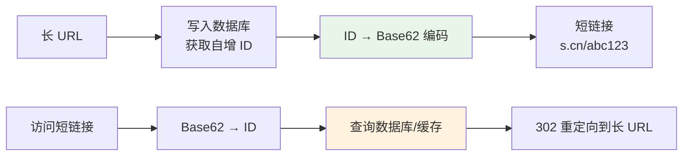
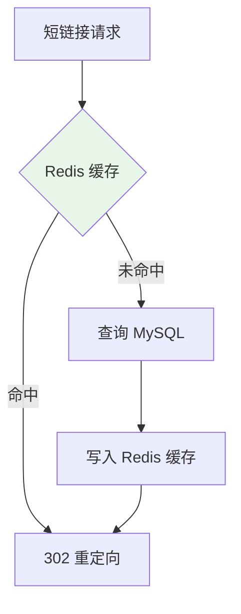

# 短链接系统设计

## 问题分析

将长 URL 转换为短 URL（如 `https://s.cn/abc123`），核心需求：
- 长链接 → 短链接（生成）
- 短链接 → 长链接（重定向，301/302）
- 高性能读取（QPS 远大于写入）
- 短链接尽量短（6-8 位）

## 方案对比

| 方案 | 原理 | 优点 | 缺点 |
|------|------|------|------|
| 哈希算法（MD5/MurmurHash） | 对长 URL 哈希后取前 N 位 | 实现简单 | 哈希冲突需处理 |
| 自增 ID + Base62 | 数据库自增 ID 转 Base62 | 无冲突，短链接有序 | 可被遍历 |
| 预生成 + 分配 | 提前生成短码池 | 高性能 | 实现复杂 |

## 推荐方案详解

### 自增 ID + Base62 编码



Base62 编码：使用 `[0-9a-zA-Z]` 共 62 个字符。6 位 Base62 可表示 62^6 ≈ 568 亿个短链接。

### 核心代码说明

```java
public class ShortUrlService {

    private static final String BASE62 = "0123456789abcdefghijklmnopqrstuvwxyzABCDEFGHIJKLMNOPQRSTUVWXYZ";

    // ID → Base62 短码
    public String encode(long id) {
        StringBuilder sb = new StringBuilder();
        while (id > 0) {
            sb.append(BASE62.charAt((int) (id % 62)));
            id /= 62;
        }
        return sb.reverse().toString();
    }

    // Base62 短码 → ID
    public long decode(String shortCode) {
        long id = 0;
        for (char c : shortCode.toCharArray()) {
            id = id * 62 + BASE62.indexOf(c);
        }
        return id;
    }
}
```

### 读取优化



- 热点短链接缓存到 Redis（TTL 24h）
- 布隆过滤器拦截不存在的短链接
- 301（永久重定向）vs 302（临时重定向）：302 便于统计访问次数

## 常见追问

### Q: 301 和 302 重定向如何选择？
301 永久重定向，浏览器会缓存，后续不再请求服务器，无法统计访问量。302 临时重定向，每次都经过服务器，可以统计访问量和做 A/B 测试。推荐 302。

### Q: 如何防止短链接被遍历？
自增 ID 可以加上随机偏移量或使用 Snowflake ID。也可以在 Base62 编码前对 ID 做简单的位运算混淆。

### Q: 如何处理相同长 URL 的重复生成？
方案一：每次生成新短链接（简单，推荐）。方案二：查询是否已存在（需要额外索引，增加写入延迟）。

## 参考资料

- [短链接系统设计](https://systemdesign.one/url-shortening-system-design/)
