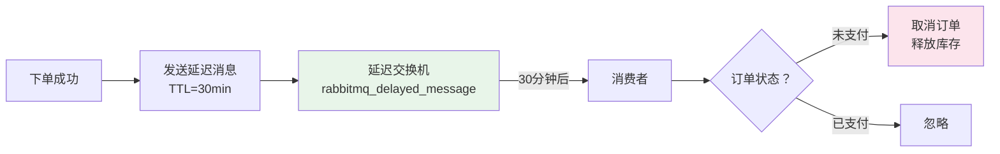

# 订单超时取消方案

## 问题分析

用户下单后未支付，需要在指定时间（如 30 分钟）后自动取消订单并释放库存。核心要求：
- 时间精度：误差在秒级
- 可靠性：不能漏取消
- 性能：不影响正常业务

## 方案对比

| 方案 | 精度 | 可靠性 | 性能 | 复杂度 |
|------|------|--------|------|--------|
| 定时任务轮询 | 分钟级 | 高 | 数据库压力大 | 低 |
| RabbitMQ 延迟队列 | 秒级 | 高 | 好 | 中 |
| Redis 过期回调 | 秒级 | 低（不可靠） | 好 | 低 |
| 时间轮（Netty HashedWheelTimer） | 毫秒级 | 低（内存） | 极好 | 中 |
| Redisson 延迟队列 | 秒级 | 高 | 好 | 中 |

## 推荐方案详解

### RabbitMQ 延迟队列（推荐）



两种实现方式：

**方式一：死信队列（DLX）**
```
普通队列（TTL=30min）→ 消息过期 → 死信交换机 → 死信队列 → 消费者处理
```

**方式二：延迟消息插件（推荐）**
```
延迟交换机（rabbitmq_delayed_message_exchange）→ 延迟后投递 → 队列 → 消费者
```

### 核心代码说明

```java
// 下单时发送延迟消息
@Service
public class OrderService {

    @Autowired
    private RabbitTemplate rabbitTemplate;

    public Order createOrder(OrderRequest request) {
        // 1. 创建订单
        Order order = saveOrder(request);

        // 2. 发送延迟取消消息（30 分钟后）
        rabbitTemplate.convertAndSend("order.delay.exchange", "order.cancel",
            order.getOrderId(),
            message -> {
                message.getMessageProperties().setDelay(30 * 60 * 1000); // 30 分钟
                return message;
            });

        return order;
    }
}

// 消费延迟消息
@RabbitListener(queues = "order.cancel.queue")
public void handleOrderCancel(String orderId) {
    Order order = orderRepository.findById(orderId);
    if (order != null && order.getStatus() == OrderStatus.UNPAID) {
        order.setStatus(OrderStatus.CANCELLED);
        orderRepository.save(order);
        // 释放库存
        stockService.releaseStock(order.getProductId(), order.getQuantity());
    }
}
```

## 常见追问

### Q: 为什么不用定时任务轮询？
定时任务需要频繁扫描数据库，数据量大时性能差。且精度取决于轮询间隔，间隔太短数据库压力大，间隔太长精度不够。

### Q: Redis 过期回调为什么不推荐？
Redis Keyspace Notification 不保证可靠性：1）消息可能丢失（Redis 重启）；2）不支持持久化；3）在 Redis 集群模式下行为不一致。适合非关键场景。

### Q: 如何保证消息不丢失？
RabbitMQ 三重保证：1）Publisher Confirm 确认消息到达 Broker；2）消息持久化（durable queue + persistent message）；3）消费者手动 ACK，处理失败进入死信队列。

## 参考资料

- [RabbitMQ Delayed Message Plugin](https://github.com/rabbitmq/rabbitmq-delayed-message-exchange)
