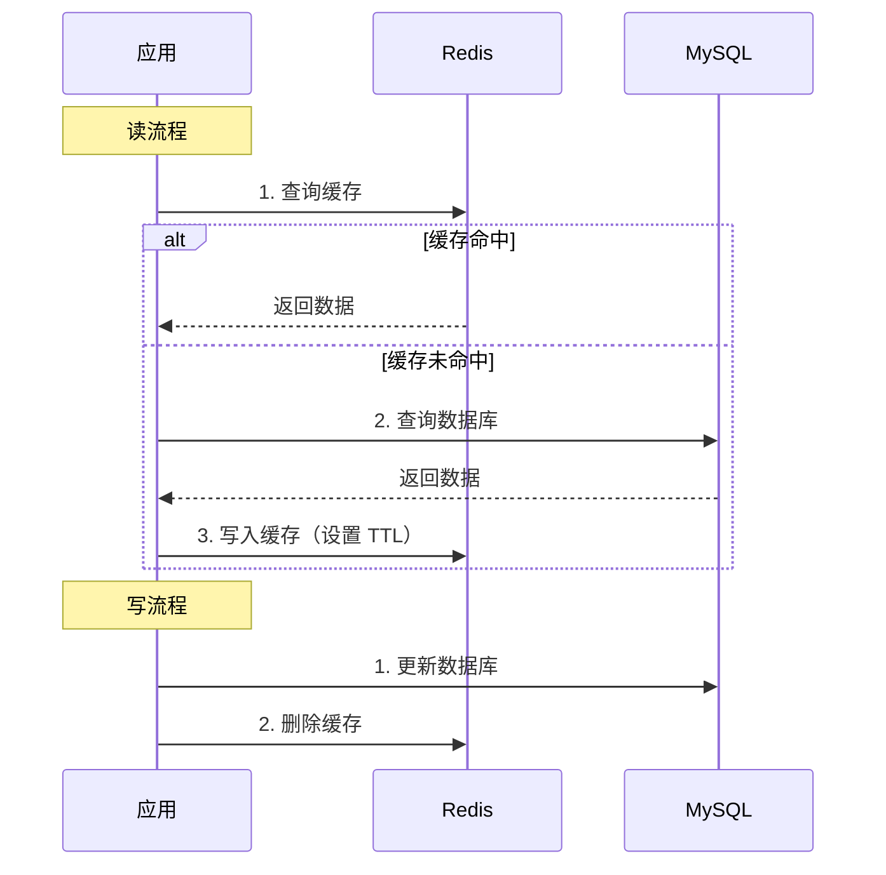
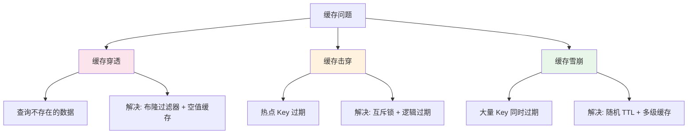
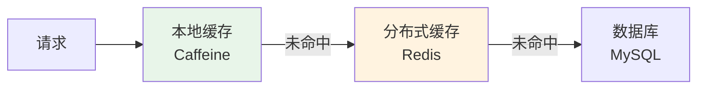

# 分布式缓存方案设计

## 问题分析

分布式缓存是提升系统性能的关键手段，但引入缓存也带来了一致性、可用性等挑战。

## 缓存策略对比

| 策略 | 读流程 | 写流程 | 一致性 | 适用场景 |
|------|--------|--------|--------|----------|
| Cache Aside | 先读缓存，未命中读 DB 写缓存 | 先更新 DB，再删缓存 | 最终一致 | 通用场景（推荐） |
| Read/Write Through | 缓存层代理读写 | 缓存层同步写 DB | 强一致 | 缓存中间件支持 |
| Write Behind | 同 Read Through | 缓存层异步写 DB | 弱一致 | 高写入场景 |

## 推荐方案详解

### Cache Aside 模式

### 缓存三大问题

### 多级缓存架构

## 常见追问

### Q: 为什么是删除缓存而不是更新缓存？
删除缓存更简单且安全。更新缓存在并发场景下可能导致数据不一致（两个线程同时更新，后更新 DB 的先更新了缓存）。删除缓存让下次读取时重新加载最新数据。

### Q: 缓存穿透如何解决？
布隆过滤器拦截不存在的 Key；缓存空值（TTL 较短，如 5 分钟）；接口层参数校验。

### Q: 热点 Key 如何处理？
互斥锁（只允许一个线程重建缓存）；逻辑过期（不设置 TTL，由后台线程异步更新）；本地缓存（Caffeine）减少 Redis 压力。

## 参考资料

- [缓存更新策略](https://coolshell.cn/articles/17416.html)
