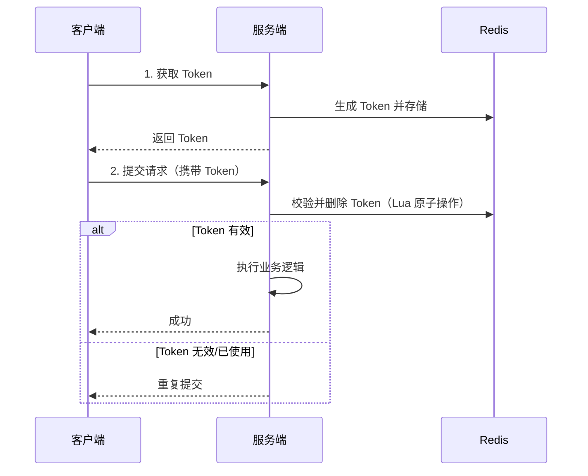

# 接口幂等性设计方案

## 问题分析

幂等性：同一操作执行一次和执行多次的效果相同。需要幂等的场景：
- 用户重复点击提交按钮
- 网络超时重试
- MQ 消息重复消费
- 微服务间调用重试

## 方案对比

| 方案 | 原理 | 优点 | 缺点 | 适用场景 |
|------|------|------|------|----------|
| Token 机制 | 先获取 Token，提交时校验并删除 | 通用性强 | 需要额外请求获取 Token | 表单提交 |
| 数据库唯一索引 | 唯一约束防止重复插入 | 简单可靠 | 只适合插入场景 | 订单创建 |
| Redis SETNX | 分布式锁防止并发 | 高性能 | 需要设置过期时间 | 通用 |
| 状态机 | 状态流转控制 | 业务语义清晰 | 需要状态设计 | 订单状态变更 |
| 乐观锁 | 版本号控制 | 无锁，性能好 | 需要 version 字段 | 更新操作 |

## 推荐方案详解

### Token 机制



### Redis SETNX 方案

```java
public boolean checkIdempotent(String idempotentKey, long expireSeconds) {
    // SETNX: 只有 Key 不存在时才设置成功
    Boolean success = redisTemplate.opsForValue()
        .setIfAbsent(idempotentKey, "1", expireSeconds, TimeUnit.SECONDS);
    return Boolean.TRUE.equals(success);
}

// 使用示例
@PostMapping("/order")
public Result createOrder(@RequestBody OrderRequest request) {
    String key = "idempotent:order:" + request.getOrderNo();
    if (!checkIdempotent(key, 300)) {
        return Result.fail("请勿重复提交");
    }
    try {
        return orderService.createOrder(request);
    } catch (Exception e) {
        redisTemplate.delete(key); // 失败时删除，允许重试
        throw e;
    }
}
```

## 常见追问

### Q: Token 方案中如何保证校验和删除的原子性？
使用 Redis Lua 脚本：`if redis.call('get',KEYS[1])==ARGV[1] then return redis.call('del',KEYS[1]) else return 0 end`。

### Q: 如何选择幂等方案？
表单提交用 Token 机制；创建操作用唯一索引；更新操作用乐观锁；MQ 消费用 Redis SETNX + 唯一消息 ID。

## 参考资料

- [接口幂等性设计](https://www.baeldung.com/cs/idempotent-operations)
