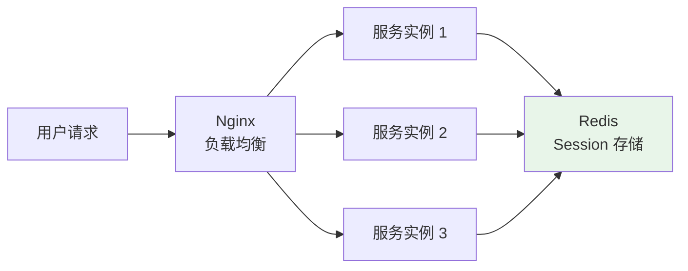
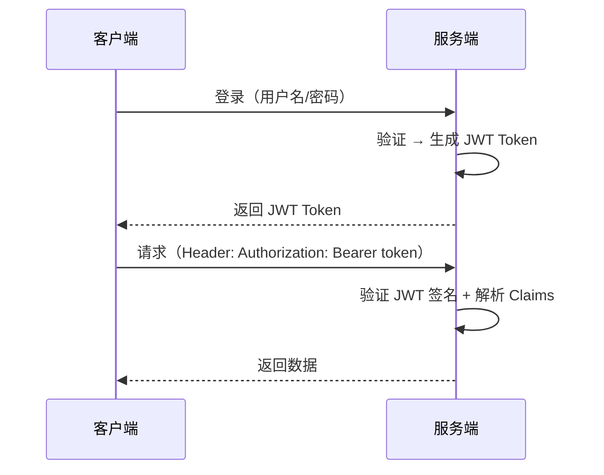

# 分布式 Session 方案

## 问题分析

单体应用的 Session 存储在服务器内存中，分布式环境下多个服务实例无法共享 Session，导致用户请求被路由到不同实例时丢失登录状态。

## 方案对比

| 方案 | 原理 | 优点 | 缺点 |
|------|------|------|------|
| Sticky Session | Nginx IP Hash 固定路由 | 简单 | 负载不均，节点故障丢失 |
| Session 复制 | Tomcat 集群同步 Session | 透明 | 网络开销大，不适合大集群 |
| Redis 集中存储 | Session 存 Redis | 高性能，支持大集群 | 依赖 Redis |
| JWT Token | 无状态 Token | 无需服务端存储 | Token 较大，无法主动失效 |
| Spring Session | Spring 封装的 Redis Session | 与 Spring 深度集成 | 依赖 Redis |

## 推荐方案详解

### 方案一：Spring Session + Redis（推荐）



```java
// 依赖
// spring-boot-starter-data-redis
// spring-session-data-redis

@Configuration
@EnableRedisHttpSession(maxInactiveIntervalInSeconds = 1800)
public class SessionConfig {
    // Spring Session 自动将 HttpSession 存储到 Redis
}
```

### 方案二：JWT Token（无状态）



JWT 结构：`Header.Payload.Signature`

### 两种方案对比

| 维度 | Spring Session + Redis | JWT |
|------|----------------------|-----|
| 状态 | 有状态（服务端存储） | 无状态 |
| 存储 | Redis | 客户端 |
| 主动失效 | ✅ 删除 Redis Key | ❌ 需要黑名单 |
| Token 大小 | 小（Session ID） | 大（包含用户信息） |
| 扩展性 | 依赖 Redis | 极好 |
| 推荐场景 | 传统 Web 应用 | 前后端分离/微服务 |

## 常见追问

### Q: JWT 如何实现主动失效（如用户修改密码后踢出）？
方案一：Redis 黑名单，将需要失效的 Token 加入黑名单，验证时检查。方案二：在用户表维护 Token 版本号，修改密码时版本号+1，验证时比对版本号。

### Q: JWT 的 Token 续期如何实现？
双 Token 方案：Access Token（短期，如 15 分钟）+ Refresh Token（长期，如 7 天）。Access Token 过期后用 Refresh Token 获取新的 Access Token。

## 在 Spring Cloud 项目中体验

本项目提供了 Redis Session 集中存储和 JWT Token 两种分布式会话方案的实战示例，可以直接运行体验登录、会话管理、Token 签发与验证等核心流程。

> 💻 实战代码：[SessionController.java](../../../code-examples/02-framework/springcloud-examples/src/main/java/com/example/springcloud/session/SessionController.java) | [JwtUtil.java](../../../code-examples/02-framework/springcloud-examples/src/main/java/com/example/springcloud/session/JwtUtil.java)

**启动步骤：**

```bash
# 1. 启动中间件
docker compose -f docker/docker-compose.yml up -d redis
docker compose -f docker/docker-compose.consul.yml up -d

# 2. 启动项目
cd code-examples/02-framework/springcloud-examples
mvn spring-boot:run
```

**验证接口：**

```bash
# Redis Session 登录
curl -X POST "http://localhost:8090/demo/session/login?username=alice"

# 查看 Session 信息（替换实际 sessionId）
curl "http://localhost:8090/demo/session/info?sessionId=xxx"

# JWT 登录
curl -X POST "http://localhost:8090/demo/session/jwt/login?username=alice"

# JWT 验证（替换实际 token）
curl "http://localhost:8090/demo/session/jwt/verify?token=xxx"

# 方案对比
curl http://localhost:8090/demo/session/compare
```

## 参考资料

- [Spring Session 文档](https://docs.spring.io/spring-session/reference/)
