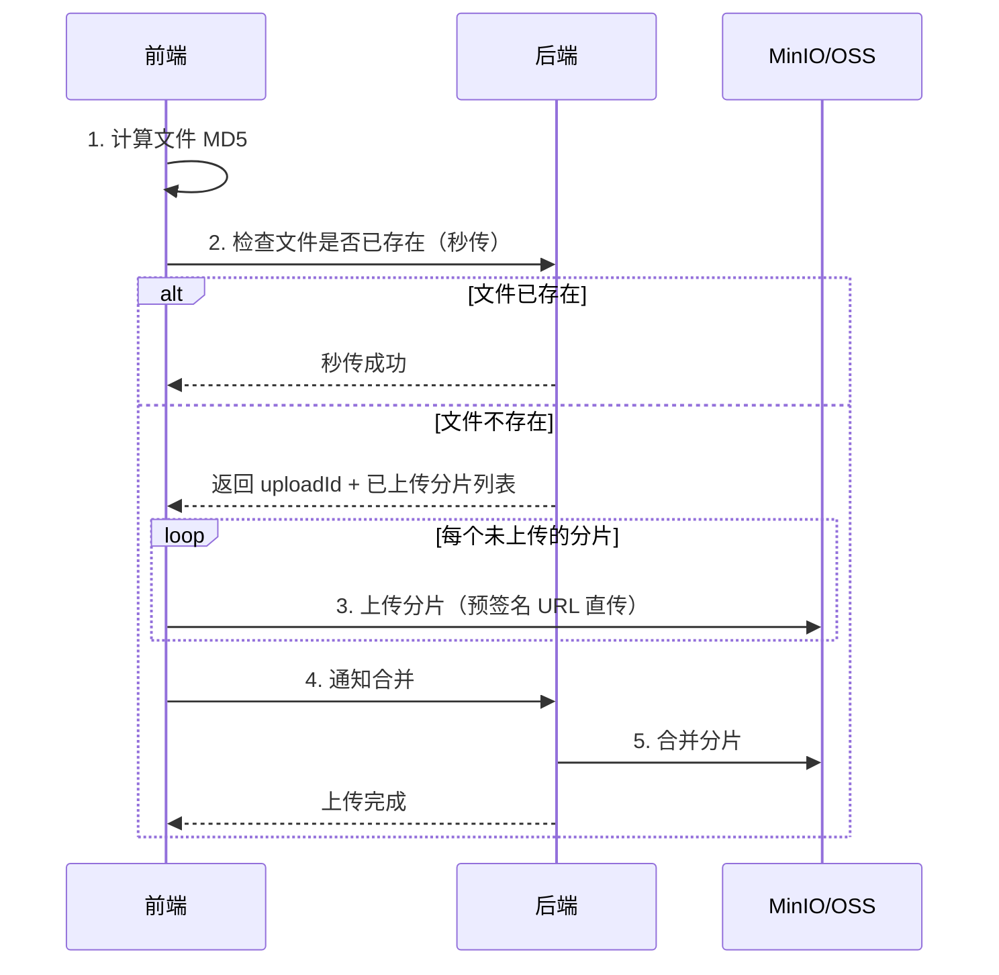

# 大文件上传方案

## 问题分析

大文件（>100MB）上传面临的挑战：
- 上传超时：HTTP 连接超时
- 网络中断：需要从头重传
- 内存溢出：服务端一次性接收大文件
- 用户体验：无进度反馈

## 方案对比

| 方案 | 优点 | 缺点 | 适用场景 |
|------|------|------|----------|
| 普通上传 | 简单 | 不支持大文件 | < 10MB |
| 分片上传 | 支持大文件、并行上传 | 实现复杂 | > 100MB |
| 分片 + 断点续传 | 网络中断可恢复 | 需要记录状态 | 推荐方案 |
| 分片 + 秒传 | 重复文件无需上传 | 需要哈希计算 | 网盘场景 |

## 推荐方案详解

### 分片上传 + 断点续传 + 秒传



### 核心代码说明

```java
@RestController
public class FileUploadController {

    // 1. 检查文件（秒传 + 断点续传）
    @PostMapping("/upload/check")
    public UploadCheckResult check(@RequestParam String fileMd5,
                                    @RequestParam String fileName,
                                    @RequestParam long fileSize) {
        // 检查文件是否已存在（秒传）
        if (fileService.existsByMd5(fileMd5)) {
            return UploadCheckResult.instantUpload(fileService.getUrlByMd5(fileMd5));
        }
        // 获取已上传的分片列表（断点续传）
        List<Integer> uploadedChunks = fileService.getUploadedChunks(fileMd5);
        String uploadId = fileService.initUpload(fileMd5, fileName, fileSize);
        return UploadCheckResult.resume(uploadId, uploadedChunks);
    }

    // 2. 上传分片
    @PostMapping("/upload/chunk")
    public Result uploadChunk(@RequestParam String uploadId,
                              @RequestParam int chunkIndex,
                              @RequestParam MultipartFile chunk) {
        fileService.uploadChunk(uploadId, chunkIndex, chunk);
        return Result.success();
    }

    // 3. 合并分片
    @PostMapping("/upload/merge")
    public Result merge(@RequestParam String uploadId,
                        @RequestParam String fileMd5) {
        String fileUrl = fileService.mergeChunks(uploadId, fileMd5);
        return Result.success(fileUrl);
    }
}
```

## 常见追问

### Q: 前端如何计算大文件的 MD5？
使用 Web Worker + SparkMD5 库，分片读取文件计算增量 MD5，避免阻塞 UI 线程。

### Q: 分片大小如何确定？
根据网络环境动态调整：WiFi/有线 5-10MB，4G 2-5MB，弱网 1-2MB。也可以固定 5MB。

### Q: 如何清理未完成的上传？
定时任务扫描超过 24 小时未完成的 uploadId，调用 MinIO 的 abortMultipartUpload 清理分片。

## 参考资料

- [大文件上传最佳实践](https://developer.mozilla.org/en-US/docs/Web/API/File_API/Using_files_from_web_applications)
