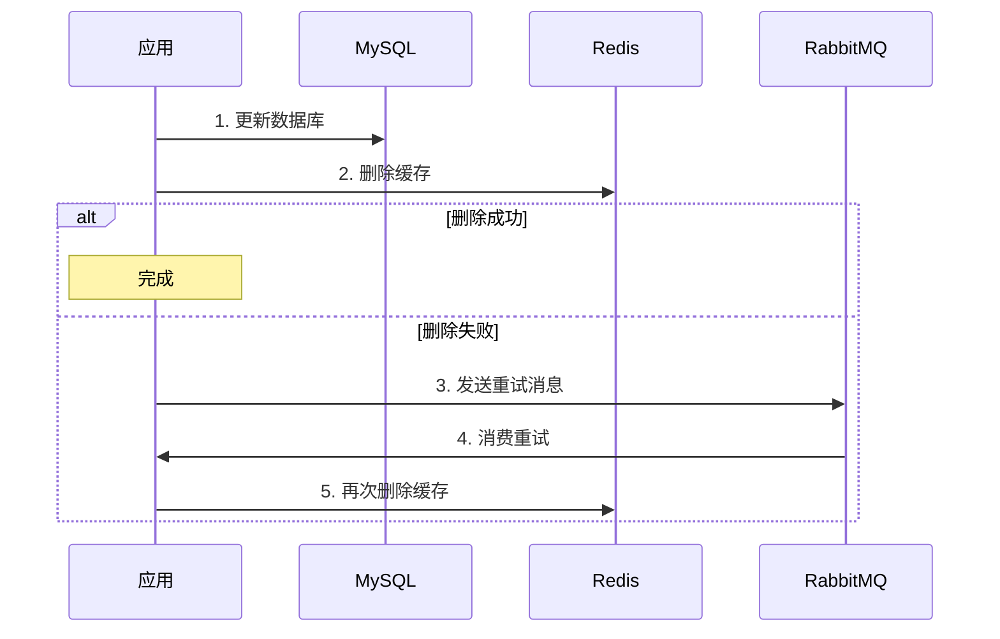
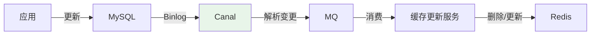

# 缓存与数据库双写一致性

## 问题分析

使用 Cache Aside 模式时，更新数据库和删除缓存是两个操作，无法保证原子性，可能导致数据不一致。

## 方案对比

| 方案 | 一致性 | 复杂度 | 性能 |
|------|--------|--------|------|
| 先更新 DB，再删缓存 | 最终一致（推荐） | 低 | 好 |
| 先删缓存，再更新 DB | 可能不一致 | 低 | 好 |
| 延迟双删 | 最终一致 | 中 | 好 |
| Canal 监听 Binlog | 最终一致 | 高 | 好 |

## 推荐方案详解

### 方案一：先更新 DB，再删缓存 + 重试



### 方案二：Canal 监听 Binlog（强一致推荐）



优势：应用只需关注数据库操作，缓存更新由独立服务处理，解耦彻底。

### 不一致场景分析

**先删缓存，再更新 DB（有问题）**：
```
线程 A: 删除缓存 → 更新 DB（耗时）
线程 B: 读缓存（未命中）→ 读 DB（旧值）→ 写缓存（旧值）
结果: 缓存中是旧值，DB 中是新值 → 不一致！
```

**先更新 DB，再删缓存（推荐）**：
```
线程 A: 更新 DB → 删除缓存
线程 B: 读缓存（未命中）→ 读 DB（新值）→ 写缓存（新值）
结果: 一致
```

极端情况（概率极低）：
```
线程 A: 读 DB（旧值）→ [线程 B 更新 DB → 删缓存] → 线程 A 写缓存（旧值）
解决: 缓存设置 TTL 兜底
```

## 常见追问

### Q: 为什么推荐"先更新 DB，再删缓存"？
因为数据库更新通常比缓存写入慢，"先删缓存再更新 DB"在并发场景下更容易出现不一致。而"先更新 DB 再删缓存"出现不一致的概率极低（需要读请求在写请求的两个操作之间完成）。

### Q: 删除缓存失败怎么办？
方案一：MQ 重试（发送删除消息到 MQ，消费者重试删除）。方案二：Canal 监听 Binlog 自动删除。方案三：缓存设置 TTL 兜底（最终一致）。

### Q: 延迟双删是什么？
先删缓存 → 更新 DB → 延迟 N 秒 → 再删缓存。第二次删除是为了清理并发读写导致的脏缓存。延迟时间需要大于一次读请求的耗时。缺点是延迟时间难以精确确定。

## 在 Spring Cloud 项目中体验

本项目提供了 Cache Aside、Write Through、延迟双删三种缓存一致性方案的实战示例，可以直接运行体验不同策略下缓存与数据库的同步行为。

> 💻 实战代码：[CacheConsistencyController.java](../../../code-examples/02-framework/springcloud-examples/src/main/java/com/example/springcloud/consistency/CacheConsistencyController.java)

**启动步骤：**

```bash
# 1. 启动中间件
docker compose -f docker/docker-compose.yml up -d mysql redis
docker compose -f docker/docker-compose.consul.yml up -d

# 2. 启动项目
cd code-examples/02-framework/springcloud-examples
mvn spring-boot:run
```

**验证接口：**

```bash
# 初始化数据（需要先执行 db/init）
curl http://localhost:8090/demo/db/init
curl http://localhost:8090/demo/consistency/init

# Cache Aside 模式（先更新 DB，再删缓存）
curl -X PUT "http://localhost:8090/demo/consistency/cache-aside?id=1&name=alice_updated"

# Write Through 模式（同时写 DB 和缓存）
curl -X PUT "http://localhost:8090/demo/consistency/write-through?id=1&name=alice_wt"

# 延迟双删模式（删缓存 → 更新 DB → 延迟再删缓存）
curl -X PUT "http://localhost:8090/demo/consistency/delay-double-delete?id=1&name=alice_ddd"

# 验证一致性
curl "http://localhost:8090/demo/consistency/verify?id=1"

# 方案对比
curl http://localhost:8090/demo/consistency/compare
```

## 参考资料

- [缓存更新的套路](https://coolshell.cn/articles/17416.html)
