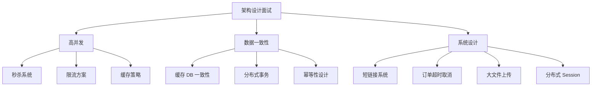

# 架构设计面试指南

## 面试知识图谱



## 高频面试题汇总

### 🔥🔥🔥 必问题

#### Q1: 秒杀系统如何设计？

**追问链路**：整体架构 → 库存扣减方案 → 防超卖 → 限流策略 → MQ 异步下单

详见 [秒杀系统设计](./01-seckill.md)

#### Q2: 缓存和数据库的一致性如何保证？

**追问链路**：Cache Aside 模式 → 先更新 DB 还是先删缓存 → 删除失败怎么办 → Canal 方案

详见 [缓存与 DB 一致性](./08-cache-db-consistency.md)

#### Q3: 接口幂等性如何设计？

**追问链路**：幂等场景 → Token 机制 → 数据库唯一索引 → Redis SETNX → 方案选择

详见 [接口幂等性设计](./05-idempotent-design.md)

### 🔥🔥 常问题

#### Q4: 订单超时取消如何实现？

**追问链路**：方案对比 → 延迟队列实现 → 消息可靠性 → 定时任务兜底

详见 [订单超时取消](./03-order-timeout.md)

#### Q5: 分布式 Session 如何实现？

**追问链路**：方案对比 → Spring Session + Redis → JWT → Token 续期 → 主动失效

详见 [分布式 Session](./06-distributed-session.md)

#### Q6: 大文件上传如何实现？

**追问链路**：分片上传 → 断点续传 → 秒传 → 预签名 URL 直传

详见 [大文件上传](./07-file-upload.md)

### 🔥 偶尔问

#### Q7: 短链接系统如何设计？

详见 [短链接系统](./02-short-url.md)

#### Q8: 分布式缓存方案如何设计？

详见 [分布式缓存方案](./04-cache-strategy.md)

## 答题框架

```
1. 需求分析
   - 功能需求：核心功能是什么？
   - 非功能需求：QPS、延迟、数据量、可用性要求

2. 方案对比
   - 列出 2-3 种方案
   - 从性能、复杂度、可靠性等维度对比
   - 说明推荐方案及理由

3. 核心设计
   - 整体架构图
   - 核心流程（时序图）
   - 关键技术点

4. 扩展讨论
   - 如何扩展？
   - 有什么风险？
   - 如何监控？
```

## 面试答题技巧

1. **先问清需求**：QPS 多少？数据量多大？一致性要求？
2. **方案对比**：不要直接给答案，先列出多种方案对比
3. **画图说明**：架构图和时序图能大幅提升表达效果
4. **提到取舍**：没有完美方案，说明你选择的理由
5. **关注细节**：异常处理、监控告警、降级方案
6. **结合实际**：如果有实际项目经验，结合项目说明
