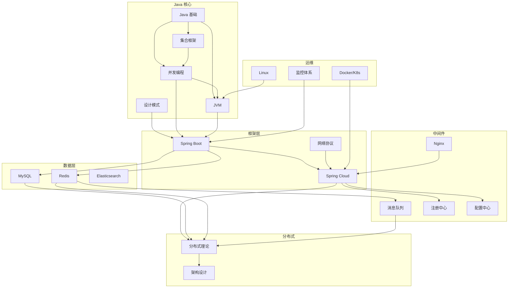
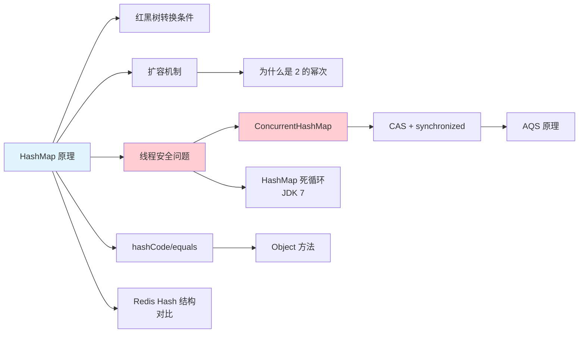
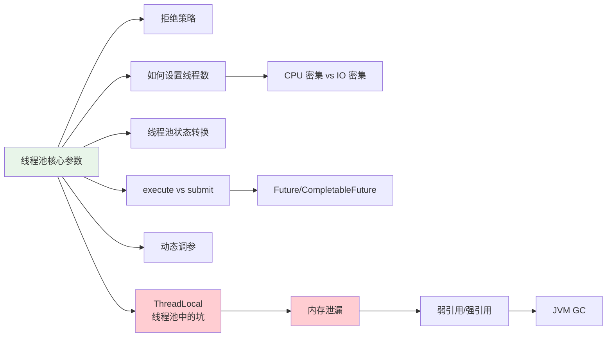
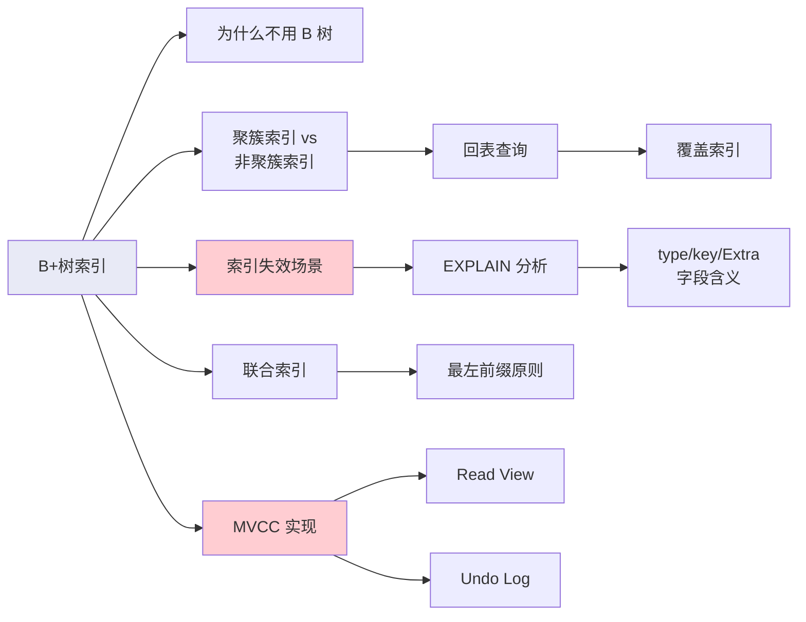
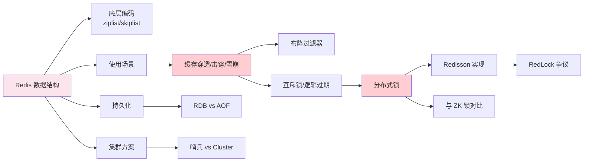
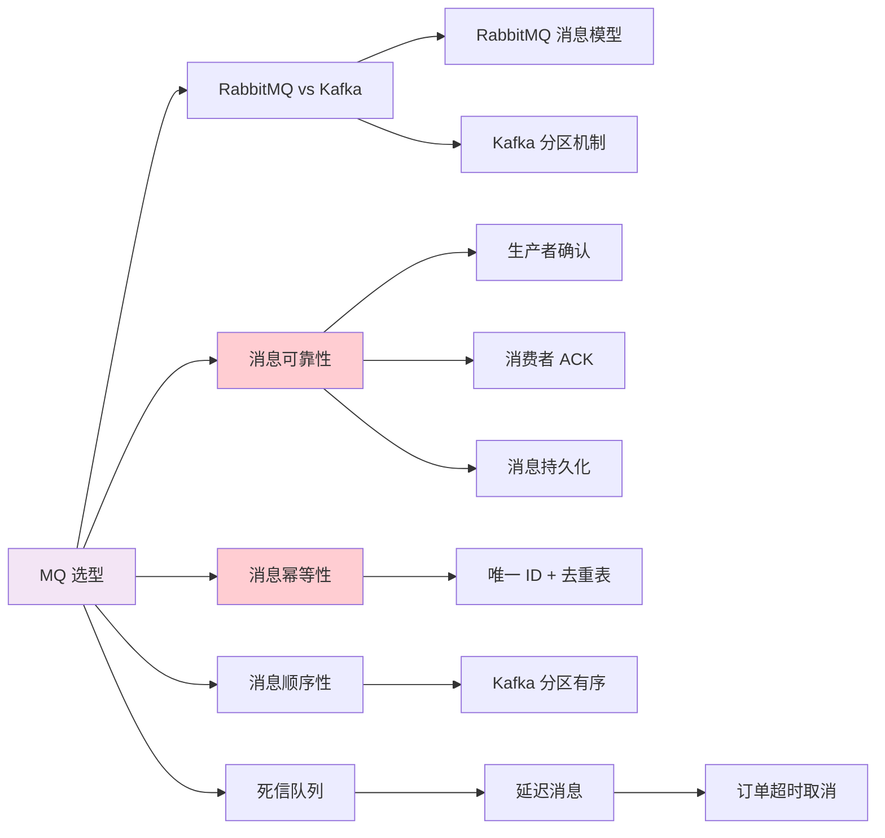
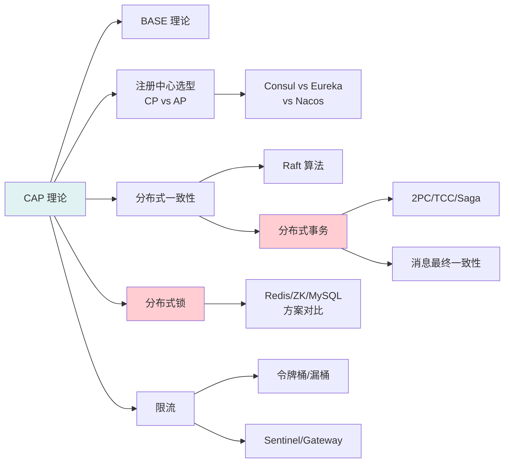
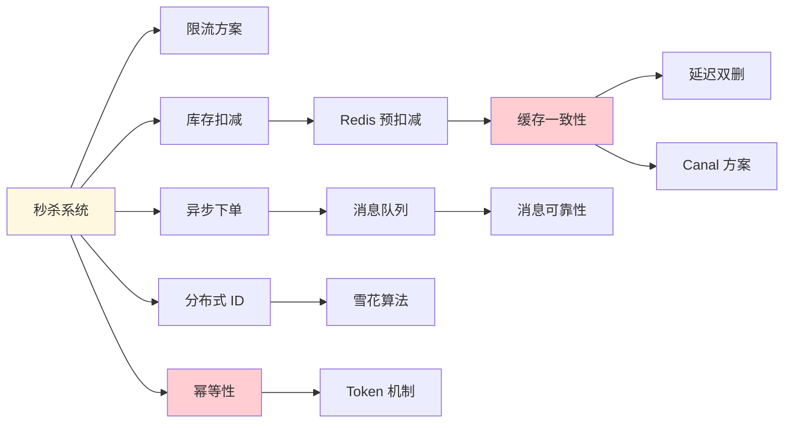

# 面试知识图谱

## 概述

本文通过 Mermaid 图展示 Java 面试中各知识模块的关联关系和常见追问路径，帮助你理解知识点之间的内在联系，在面试中做到举一反三。

## 全局知识图谱



## 模块间追问链路

### 1. HashMap 追问链路

面试官从 HashMap 出发，可以追问到并发、JVM、Redis 等多个方向。



**追问路径**：HashMap → 红黑树 → 扩容 → 线程安全 → ConcurrentHashMap → CAS → AQS

**相关文档**：
- [集合框架](/1-java-core/1.1-java-basics/05-collections)
- [集合源码分析](/1-java-core/1.2-java-advanced/01-collections-source)
- [CAS/原子类](/1-java-core/1.3-concurrent/09-cas-atomic)

### 2. 线程池追问链路



**追问路径**：线程池参数 → 拒绝策略 → 线程数设置 → ThreadLocal 坑 → 内存泄漏 → GC

**相关文档**：
- [线程池原理](/1-java-core/1.3-concurrent/05-thread-pool)
- [ThreadLocal](/1-java-core/1.3-concurrent/07-threadlocal)
- [CompletableFuture](/1-java-core/1.3-concurrent/08-completable-future)
- [GC 算法](/1-java-core/1.4-jvm/02-gc)

### 3. Spring Boot 追问链路

```mermaid
graph LR
    A[Spring Boot 启动流程] --> B[自动配置原理]
    B --> C[条件注解<br/>@Conditional]
    A --> D[Bean 生命周期]
    D --> E[BeanPostProcessor]
    D --> F[循环依赖]
    F --> G[三级缓存]
    G --> H[为什么是三级<br/>不是二级]
    H --> I[AOP 代理]
    I --> J[JDK 代理 vs CGLIB]
    I --> K[事务失效场景]
    K --> L[@Transactional 原理]

    style A fill:#fff3e0
    style F fill:#ffcdd2
    style K fill:#ffcdd2
```

**追问路径**：启动流程 → 自动配置 → Bean 生命周期 → 循环依赖 → 三级缓存 → AOP → 事务失效

**相关文档**：
- [启动流程](/2-framework/2.2-springboot/04-startup)
- [IoC/DI](/2-framework/2.2-springboot/01-ioc-di)
- [循环依赖](/2-framework/2.2-springboot/03-circular-dependency)
- [AOP 原理](/2-framework/2.2-springboot/02-aop)

### 4. MySQL 索引追问链路



**追问路径**：B+树 → 聚簇索引 → 回表 → 覆盖索引 → 索引失效 → EXPLAIN → MVCC

**相关文档**：
- [索引原理](/3-data-store/3.1-database/01-index-theory)
- [SQL 优化](/3-data-store/3.1-database/04-optimization)
- [事务与 MVCC](/3-data-store/3.1-database/02-transaction)
- [日志系统](/3-data-store/3.1-database/07-log-system)

### 5. Redis 追问链路



**追问路径**：数据结构 → 底层编码 → 缓存问题 → 分布式锁 → Redisson → RedLock

**相关文档**：
- [数据结构](/3-data-store/3.2-redis/01-data-structures)
- [缓存问题](/3-data-store/3.2-redis/04-cache-problems)
- [分布式锁](/3-data-store/3.2-redis/05-distributed-lock)
- [主从/哨兵/Cluster](/3-data-store/3.2-redis/03-replication)

### 6. 消息队列追问链路



**追问路径**：MQ 选型 → 消息可靠性 → 幂等性 → 顺序性 → 死信队列 → 延迟消息 → 订单超时

**相关文档**：
- [RabbitMQ 核心](/4-middleware/4.1-mq-rabbitmq/01-rabbitmq)
- [RabbitMQ 可靠性](/4-middleware/4.1-mq-rabbitmq/02-rabbitmq-reliability)
- [Kafka 架构](/4-middleware/4.2-mq-kafka/01-kafka)
- [Kafka 可靠性](/4-middleware/4.2-mq-kafka/02-kafka-reliability)
- [订单超时取消](/8-architecture/03-order-timeout)

### 7. 分布式系统追问链路



**追问路径**：CAP → 注册中心选型 → 分布式事务 → 分布式锁 → 限流

**相关文档**：
- [CAP/BASE 理论](/5-distributed/5.1-distributed/01-cap-base)
- [一致性算法](/5-distributed/5.1-distributed/02-consensus)
- [分布式事务](/5-distributed/5.1-distributed/04-distributed-transaction)
- [分布式锁](/5-distributed/5.1-distributed/03-distributed-lock)
- [限流算法](/5-distributed/5.1-distributed/06-rate-limiting)

### 8. 架构设计追问链路



**追问路径**：秒杀系统 → 限流 → 库存扣减 → 缓存一致性 → 消息队列 → 幂等性

**相关文档**：
- [秒杀系统](/8-architecture/01-seckill)
- [缓存方案](/8-architecture/04-cache-strategy)
- [缓存一致性](/8-architecture/08-cache-db-consistency)
- [幂等性方案](/8-architecture/05-idempotent-design)

## 面试追问应对策略

### 追问模式识别

| 追问模式 | 特征 | 应对策略 |
|----------|------|----------|
| 深度追问 | 从表面到底层原理 | 提前准备源码级答案 |
| 横向追问 | 从一个知识点跳到相关知识点 | 理解知识图谱中的关联 |
| 场景追问 | 从理论到实际应用 | 准备项目中的实际案例 |
| 对比追问 | 不同方案的优缺点对比 | 整理对比表格，记住关键差异 |

### 高频追问组合

1. **HashMap → ConcurrentHashMap → CAS → AQS → 线程池**
2. **Spring IoC → Bean 生命周期 → 循环依赖 → AOP → 事务**
3. **MySQL 索引 → EXPLAIN → 锁机制 → MVCC → 分库分表**
4. **Redis 数据结构 → 缓存问题 → 分布式锁 → 集群方案**
5. **MQ 选型 → 消息可靠性 → 幂等性 → 延迟消息 → 架构设计**
6. **CAP → 注册中心 → 分布式事务 → 分布式锁 → 限流**
