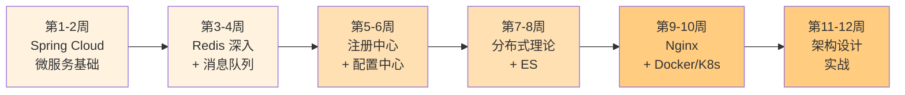

# Java 高级深入学习路径

## 路径概览

| 项目 | 说明 |
|------|------|
| 适合人群 | 有 3 年以上 Java 开发经验，希望向架构方向发展的开发者 |
| 前置知识 | 完成 [Java 中级进阶路径](/learning-paths/intermediate) 或具备同等水平 |
| 预计时长 | 8-12 周（每天 2-3 小时） |
| 学习目标 | 掌握微服务架构全栈技术，具备分布式系统设计能力 |

## 学习路线图

## 学习步骤

### 第 1-2 周：Spring Cloud 微服务

| 步骤 | 知识点 | 文档链接 | 建议时间 |
|------|--------|----------|----------|
| 1 | 服务注册与发现 | [服务注册与发现（Consul 优先）](/2-framework/2.3-springcloud/01-registry) | 3 小时 |
| 2 | 负载均衡 | [Ribbon/LoadBalancer](/2-framework/2.3-springcloud/02-loadbalancer) | 2 小时 |
| 3 | 服务调用 | [OpenFeign/超时重试](/2-framework/2.3-springcloud/03-feign) | 3 小时 |
| 4 | 熔断降级 | [Sentinel/Resilience4j](/2-framework/2.3-springcloud/04-circuit-breaker) | 3 小时 |
| 5 | 网关 | [Gateway 路由/过滤器/限流](/2-framework/2.3-springcloud/05-gateway) | 4 小时 |
| 6 | 配置中心集成 | [Apollo/Nacos Config](/2-framework/2.3-springcloud/06-config) | 2 小时 |
| 7 | 链路追踪 | [Sleuth/Zipkin/SkyWalking](/2-framework/2.3-springcloud/07-tracing) | 3 小时 |
| 8 | 分布式事务 | [Seata AT/TCC](/2-framework/2.3-springcloud/08-transaction) | 3 小时 |
| 9 | 版本兼容性 | [版本兼容性对照表](/2-framework/2.3-springcloud/09-version-compatibility) | 1 小时 |

**本阶段目标**：掌握 Spring Cloud 微服务全家桶，能独立搭建微服务架构。

### 第 3-4 周：Redis 深入 + 消息队列

| 步骤 | 知识点 | 文档链接 | 建议时间 |
|------|--------|----------|----------|
| 10 | Redis 数据结构 | [数据结构与底层实现](/3-data-store/3.2-redis/01-data-structures) | 3 小时 |
| 11 | Redis 持久化 | [RDB/AOF 持久化](/3-data-store/3.2-redis/02-persistence) | 2 小时 |
| 12 | Redis 集群 | [主从/哨兵/Cluster](/3-data-store/3.2-redis/03-replication) | 3 小时 |
| 13 | 缓存问题 | [穿透/击穿/雪崩](/3-data-store/3.2-redis/04-cache-problems) | 3 小时 |
| 14 | 分布式锁 | [Redis 分布式锁](/3-data-store/3.2-redis/05-distributed-lock) | 2 小时 |
| 15 | RabbitMQ 核心 | [RabbitMQ 核心概念](/4-middleware/4.1-mq-rabbitmq/01-rabbitmq) | 3 小时 |
| 16 | RabbitMQ 可靠性 | [消息可靠性/幂等性](/4-middleware/4.1-mq-rabbitmq/02-rabbitmq-reliability) | 2 小时 |
| 17 | RabbitMQ 高级 | [死信队列/延迟消息](/4-middleware/4.1-mq-rabbitmq/03-rabbitmq-advanced) | 2 小时 |
| 18 | Kafka 架构 | [Kafka 架构与原理](/4-middleware/4.2-mq-kafka/01-kafka) | 3 小时 |
| 19 | Kafka 可靠性 | [消息可靠性/顺序性](/4-middleware/4.2-mq-kafka/02-kafka-reliability) | 2 小时 |
| 20 | Kafka 高级 | [分区策略/消费者组](/4-middleware/4.2-mq-kafka/03-kafka-advanced) | 2 小时 |

**本阶段目标**：深入理解 Redis 数据结构和集群方案，掌握 RabbitMQ 和 Kafka 的核心原理。

### 第 5-6 周：注册中心 + 配置中心

| 步骤 | 知识点 | 文档链接 | 建议时间 |
|------|--------|----------|----------|
| 21 | 服务注册发现原理 | [服务注册与发现原理](/4-middleware/4.5-registry/01-principles) | 2 小时 |
| 22 | Consul 深入 | [Consul 架构/健康检查/ACL](/4-middleware/4.5-registry/02-consul) | 4 小时 |
| 23 | Zookeeper | [ZAB/临时节点/Watcher](/4-middleware/4.5-registry/03-zookeeper) | 3 小时 |
| 24 | 注册中心选型 | [注册中心选型对比表](/4-middleware/4.5-registry/05-comparison) | 2 小时 |
| 25 | Apollo 配置中心 | [Apollo 架构/热更新/灰度](/4-middleware/4.4-config-center/01-apollo) | 4 小时 |
| 26 | Nacos Config | [Nacos Config 使用](/4-middleware/4.4-config-center/02-nacos-config) | 2 小时 |
| 27 | 配置中心对比 | [Apollo vs Nacos vs Spring Cloud Config](/4-middleware/4.4-config-center/03-comparison) | 2 小时 |
| 28 | 配置安全 | [配置加密与安全](/4-middleware/4.4-config-center/04-security) | 1 小时 |

**本阶段目标**：深入理解注册中心和配置中心的原理，掌握 Consul 和 Apollo 的使用。

### 第 7-8 周：分布式理论 + Elasticsearch

| 步骤 | 知识点 | 文档链接 | 建议时间 |
|------|--------|----------|----------|
| 29 | CAP/BASE 理论 | [CAP 与 BASE 理论](/5-distributed/5.1-distributed/01-cap-base) | 3 小时 |
| 30 | 一致性算法 | [Raft/Paxos 算法](/5-distributed/5.1-distributed/02-consensus) | 4 小时 |
| 31 | 分布式锁对比 | [Redis/ZK/MySQL 分布式锁](/5-distributed/5.1-distributed/03-distributed-lock) | 3 小时 |
| 32 | 分布式事务 | [2PC/TCC/Saga/消息一致性](/5-distributed/5.1-distributed/04-distributed-transaction) | 4 小时 |
| 33 | 幂等性设计 | [幂等性设计](/5-distributed/5.1-distributed/05-idempotent) | 2 小时 |
| 34 | 限流算法 | [令牌桶/漏桶/滑动窗口](/5-distributed/5.1-distributed/06-rate-limiting) | 2 小时 |
| 35 | ES 倒排索引 | [倒排索引原理](/3-data-store/3.3-elasticsearch/01-inverted-index) | 2 小时 |
| 36 | ES 查询 | [DSL 复合查询](/3-data-store/3.3-elasticsearch/04-dsl-query) | 3 小时 |
| 37 | ES Spring 集成 | [Spring Data ES 集成](/3-data-store/3.3-elasticsearch/06-spring-data) | 2 小时 |

**本阶段目标**：掌握分布式系统核心理论，理解 Elasticsearch 的原理和使用。

### 第 9-10 周：Nginx + Docker/K8s

| 步骤 | 知识点 | 文档链接 | 建议时间 |
|------|--------|----------|----------|
| 38 | Nginx 架构 | [Master-Worker 模型](/4-middleware/4.6-nginx/01-architecture) | 2 小时 |
| 39 | 反向代理与负载均衡 | [反向代理配置](/4-middleware/4.6-nginx/02-reverse-proxy) | 3 小时 |
| 40 | Nginx 限流 | [限流防刷](/4-middleware/4.6-nginx/05-rate-limit) | 2 小时 |
| 41 | Docker 基础 | [镜像/容器/仓库](/6-devops/6.1-docker-k8s/01-docker-basics) | 3 小时 |
| 42 | Dockerfile | [多阶段构建/镜像瘦身](/6-devops/6.1-docker-k8s/02-dockerfile) | 2 小时 |
| 43 | Docker Compose | [多服务编排](/6-devops/6.1-docker-k8s/04-docker-compose) | 2 小时 |
| 44 | K8s 架构 | [K8s 架构与核心组件](/6-devops/6.1-docker-k8s/06-k8s-architecture) | 3 小时 |
| 45 | K8s 资源对象 | [Pod/Deployment/Service](/6-devops/6.1-docker-k8s/07-k8s-resources) | 3 小时 |
| 46 | K8s 部署策略 | [滚动更新/蓝绿/金丝雀](/6-devops/6.1-docker-k8s/09-k8s-deploy) | 2 小时 |

**本阶段目标**：掌握 Nginx 配置和 Docker/K8s 容器化部署。

### 第 11-12 周：架构设计实战

| 步骤 | 知识点 | 文档链接 | 建议时间 |
|------|--------|----------|----------|
| 47 | 秒杀系统设计 | [秒杀系统设计](/8-architecture/01-seckill) | 4 小时 |
| 48 | 短链接系统 | [短链接系统设计](/8-architecture/02-short-url) | 3 小时 |
| 49 | 订单超时取消 | [订单超时取消方案](/8-architecture/03-order-timeout) | 3 小时 |
| 50 | 缓存方案设计 | [分布式缓存方案](/8-architecture/04-cache-strategy) | 3 小时 |
| 51 | 幂等性方案 | [接口幂等性设计方案](/8-architecture/05-idempotent-design) | 2 小时 |
| 52 | 缓存与 DB 一致性 | [缓存与 DB 双写一致性](/8-architecture/08-cache-db-consistency) | 3 小时 |

**本阶段目标**：掌握常见架构设计场景的方案分析和核心实现。

## 学习建议

1. Spring Cloud 组件较多，建议先搭建一个完整的微服务 Demo 项目，边学边实践
2. Redis 和消息队列是面试高频考点，重点掌握缓存问题解决方案和消息可靠性保证
3. 分布式理论偏抽象，建议结合具体中间件（如 Redis 分布式锁）来理解
4. 架构设计场景建议先自己思考方案，再对照文档查漏补缺
5. 每个模块学完后，做一遍对应的面试指南进行自测
