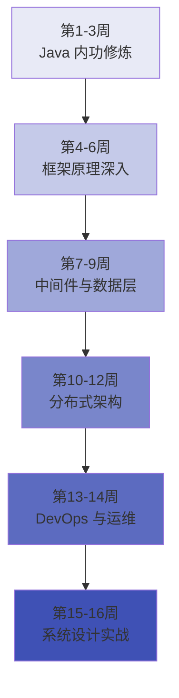
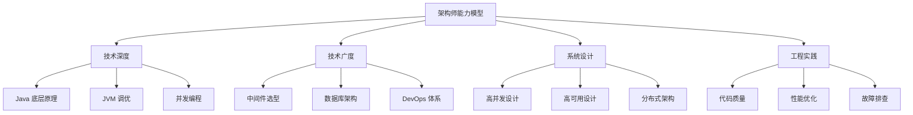

# 架构师成长学习路径

## 路径概览

| 项目 | 说明 |
|------|------|
| 适合人群 | 有 5 年以上 Java 开发经验，目标成为技术架构师的开发者 |
| 前置知识 | 完成 [Java 高级深入路径](/learning-paths/advanced) 或具备同等水平 |
| 预计时长 | 12-16 周（每天 2-3 小时） |
| 学习目标 | 构建全栈技术体系，具备系统设计和技术选型能力 |

## 学习路线图

## 学习步骤

### 第 1-3 周：Java 内功修炼

> 架构师首先是一名优秀的 Java 开发者，底层原理必须扎实。

#### 第 1 周：并发编程与 JMM

| 步骤 | 知识点 | 文档链接 | 建议时间 |
|------|--------|----------|----------|
| 1 | synchronized 原理 | [synchronized 与锁升级](/1-java-core/1.3-concurrent/02-synchronized) | 3 小时 |
| 2 | AQS 源码分析 | [ReentrantLock/AQS 源码](/1-java-core/1.3-concurrent/03-reentrantlock-aqs) | 4 小时 |
| 3 | 线程池深入 | [线程池原理与最佳实践](/1-java-core/1.3-concurrent/05-thread-pool) | 3 小时 |
| 4 | CAS 与无锁编程 | [CAS/原子类/LongAdder](/1-java-core/1.3-concurrent/09-cas-atomic) | 2 小时 |
| 5 | JMM 与 happens-before | [JMM/happens-before](/1-java-core/1.2-java-advanced/07-jmm) | 3 小时 |

#### 第 2 周：JVM 深入与调优

| 步骤 | 知识点 | 文档链接 | 建议时间 |
|------|--------|----------|----------|
| 6 | JVM 内存模型 | [JVM 内存模型](/1-java-core/1.4-jvm/01-memory-model) | 3 小时 |
| 7 | GC 算法与收集器 | [GC 算法/CMS/G1/ZGC](/1-java-core/1.4-jvm/02-gc) | 4 小时 |
| 8 | JIT 与逃逸分析 | [JIT 编译与逃逸分析](/1-java-core/1.4-jvm/04-jit) | 2 小时 |
| 9 | JVM 调优实战 | [JVM 调优参数](/1-java-core/1.4-jvm/05-tuning) | 3 小时 |
| 10 | 诊断工具实战 | [内存泄漏排查/Arthas](/1-java-core/1.4-jvm/06-diagnostic) | 3 小时 |

#### 第 3 周：设计模式与架构原则

| 步骤 | 知识点 | 文档链接 | 建议时间 |
|------|--------|----------|----------|
| 11 | 创建型模式 | [单例/工厂/建造者/原型](/1-java-core/1.5-design-patterns/01-creational) | 2 小时 |
| 12 | 结构型模式 | [代理/适配器/装饰器/门面](/1-java-core/1.5-design-patterns/02-structural) | 2 小时 |
| 13 | 行为型模式 | [策略/模板方法/观察者/责任链](/1-java-core/1.5-design-patterns/03-behavioral) | 2 小时 |
| 14 | Spring 中的设计模式 | [Spring 框架中的设计模式](/1-java-core/1.5-design-patterns/04-spring-patterns) | 3 小时 |
| 15 | SOLID 原则 | [SOLID/DRY/KISS](/1-java-core/1.5-design-patterns/05-principles) | 2 小时 |
| 16 | 集合源码分析 | [HashMap/ConcurrentHashMap 源码](/1-java-core/1.2-java-advanced/01-collections-source) | 3 小时 |

**阶段目标**：深入理解 Java 并发模型、JVM 底层原理和设计模式，为架构设计打下坚实基础。

### 第 4-6 周：框架原理深入

> 架构师需要理解框架的设计思想，而不仅仅是使用。

#### 第 4 周：Spring Boot 原理

| 步骤 | 知识点 | 文档链接 | 建议时间 |
|------|--------|----------|----------|
| 17 | IoC 容器原理 | [IoC/DI/Bean 生命周期](/2-framework/2.2-springboot/01-ioc-di) | 4 小时 |
| 18 | AOP 原理 | [AOP/事务失效场景](/2-framework/2.2-springboot/02-aop) | 3 小时 |
| 19 | 循环依赖 | [循环依赖三级缓存](/2-framework/2.2-springboot/03-circular-dependency) | 2 小时 |
| 20 | 启动流程 | [启动流程与自动配置](/2-framework/2.2-springboot/04-startup) | 3 小时 |
| 21 | 自定义 Starter | [Starter 机制与自定义](/2-framework/2.2-springboot/05-starter) | 3 小时 |

#### 第 5 周：Spring Cloud 微服务架构

| 步骤 | 知识点 | 文档链接 | 建议时间 |
|------|--------|----------|----------|
| 22 | 服务注册发现 | [服务注册与发现](/2-framework/2.3-springcloud/01-registry) | 3 小时 |
| 23 | 熔断降级 | [Sentinel/Resilience4j](/2-framework/2.3-springcloud/04-circuit-breaker) | 3 小时 |
| 24 | 网关设计 | [Gateway 路由/过滤器/限流](/2-framework/2.3-springcloud/05-gateway) | 4 小时 |
| 25 | 链路追踪 | [Sleuth/Zipkin/SkyWalking](/2-framework/2.3-springcloud/07-tracing) | 3 小时 |
| 26 | 分布式事务 | [Seata AT/TCC](/2-framework/2.3-springcloud/08-transaction) | 3 小时 |

#### 第 6 周：网络与安全

| 步骤 | 知识点 | 文档链接 | 建议时间 |
|------|--------|----------|----------|
| 27 | TCP/IP 深入 | [TCP/IP 协议栈](/2-framework/2.1-network/01-tcp-ip) | 3 小时 |
| 28 | HTTP/2 与 HTTP/3 | [HTTP/HTTPS/HTTP2/HTTP3](/2-framework/2.1-network/02-http) | 2 小时 |
| 29 | WebSocket | [WebSocket 协议](/2-framework/2.1-network/03-websocket) | 2 小时 |
| 30 | RPC 框架原理 | [Dubbo/gRPC 原理](/2-framework/2.1-network/07-rpc) | 3 小时 |
| 31 | 安全体系 | [Spring Security/OAuth2](/2-framework/2.2-springboot/09-security) | 3 小时 |
| 32 | 网络安全 | [XSS/CSRF/SQL 注入](/2-framework/2.1-network/05-security) | 2 小时 |

**阶段目标**：深入理解 Spring 生态的设计思想，掌握微服务架构的核心组件原理。

### 第 7-9 周：中间件与数据层

> 架构师需要对各种中间件有深入理解，才能做出正确的技术选型。

#### 第 7 周：数据库架构

| 步骤 | 知识点 | 文档链接 | 建议时间 |
|------|--------|----------|----------|
| 33 | 索引原理 | [B+树与索引原理](/3-data-store/3.1-database/01-index-theory) | 3 小时 |
| 34 | 事务与 MVCC | [事务/隔离级别/MVCC](/3-data-store/3.1-database/02-transaction) | 3 小时 |
| 35 | 锁机制 | [行锁/间隙锁/临键锁](/3-data-store/3.1-database/03-lock) | 2 小时 |
| 36 | 分库分表 | [分库分表/ShardingSphere](/3-data-store/3.1-database/05-sharding) | 4 小时 |
| 37 | Binlog 与数据同步 | [Binlog/Canal/主从同步](/3-data-store/3.1-database/06-binlog) | 3 小时 |
| 38 | 高可用方案 | [主从/MGR/Proxy](/3-data-store/3.1-database/08-high-availability) | 2 小时 |

#### 第 8 周：Redis + Elasticsearch

| 步骤 | 知识点 | 文档链接 | 建议时间 |
|------|--------|----------|----------|
| 39 | Redis 数据结构 | [数据结构与底层实现](/3-data-store/3.2-redis/01-data-structures) | 3 小时 |
| 40 | Redis 集群 | [主从/哨兵/Cluster](/3-data-store/3.2-redis/03-replication) | 3 小时 |
| 41 | 缓存问题 | [穿透/击穿/雪崩](/3-data-store/3.2-redis/04-cache-problems) | 2 小时 |
| 42 | 分布式锁 | [Redis 分布式锁](/3-data-store/3.2-redis/05-distributed-lock) | 2 小时 |
| 43 | ES 倒排索引 | [倒排索引原理](/3-data-store/3.3-elasticsearch/01-inverted-index) | 2 小时 |
| 44 | ES 查询与聚合 | [DSL 复合查询](/3-data-store/3.3-elasticsearch/04-dsl-query) | 2 小时 |
| 45 | ES 聚合分析 | [聚合分析](/3-data-store/3.3-elasticsearch/05-aggregation) | 2 小时 |

#### 第 9 周：消息队列 + 注册/配置中心

| 步骤 | 知识点 | 文档链接 | 建议时间 |
|------|--------|----------|----------|
| 46 | RabbitMQ 深入 | [RabbitMQ 核心概念](/4-middleware/4.1-mq-rabbitmq/01-rabbitmq) | 2 小时 |
| 47 | RabbitMQ 可靠性 | [消息可靠性/幂等性](/4-middleware/4.1-mq-rabbitmq/02-rabbitmq-reliability) | 2 小时 |
| 48 | Kafka 深入 | [Kafka 架构与原理](/4-middleware/4.2-mq-kafka/01-kafka) | 3 小时 |
| 49 | Kafka 高级 | [分区策略/消费者组](/4-middleware/4.2-mq-kafka/03-kafka-advanced) | 2 小时 |
| 50 | Consul 深入 | [Consul 架构/健康检查/ACL](/4-middleware/4.5-registry/02-consul) | 3 小时 |
| 51 | Apollo 配置中心 | [Apollo 架构/热更新/灰度](/4-middleware/4.4-config-center/01-apollo) | 3 小时 |

**阶段目标**：深入理解各中间件的架构设计和适用场景，具备技术选型能力。

### 第 10-12 周：分布式架构

> 架构师的核心能力：分布式系统设计。

#### 第 10 周：分布式理论

| 步骤 | 知识点 | 文档链接 | 建议时间 |
|------|--------|----------|----------|
| 52 | CAP/BASE 理论 | [CAP 与 BASE 理论](/5-distributed/5.1-distributed/01-cap-base) | 3 小时 |
| 53 | 一致性算法 | [Raft/Paxos 算法](/5-distributed/5.1-distributed/02-consensus) | 4 小时 |
| 54 | 分布式锁 | [Redis/ZK/MySQL 分布式锁](/5-distributed/5.1-distributed/03-distributed-lock) | 3 小时 |
| 55 | 分布式事务 | [2PC/TCC/Saga/消息一致性](/5-distributed/5.1-distributed/04-distributed-transaction) | 4 小时 |

#### 第 11 周：高可用设计

| 步骤 | 知识点 | 文档链接 | 建议时间 |
|------|--------|----------|----------|
| 56 | 幂等性设计 | [幂等性设计](/5-distributed/5.1-distributed/05-idempotent) | 2 小时 |
| 57 | 限流算法 | [令牌桶/漏桶/滑动窗口](/5-distributed/5.1-distributed/06-rate-limiting) | 3 小时 |
| 58 | Nginx 架构 | [Master-Worker 模型](/4-middleware/4.6-nginx/01-architecture) | 2 小时 |
| 59 | 负载均衡 | [负载均衡策略](/4-middleware/4.6-nginx/03-load-balance) | 2 小时 |
| 60 | Nginx 高级 | [OpenResty/高可用/性能调优](/4-middleware/4.6-nginx/07-advanced) | 3 小时 |
| 61 | 限流防刷 | [Nginx 限流防刷](/4-middleware/4.6-nginx/05-rate-limit) | 2 小时 |

#### 第 12 周：架构设计实战（上）

| 步骤 | 知识点 | 文档链接 | 建议时间 |
|------|--------|----------|----------|
| 62 | 秒杀系统 | [秒杀系统设计](/8-architecture/01-seckill) | 4 小时 |
| 63 | 缓存方案 | [分布式缓存方案](/8-architecture/04-cache-strategy) | 3 小时 |
| 64 | 缓存一致性 | [缓存与 DB 双写一致性](/8-architecture/08-cache-db-consistency) | 3 小时 |
| 65 | 订单超时 | [订单超时取消方案](/8-architecture/03-order-timeout) | 3 小时 |

**阶段目标**：掌握分布式系统核心理论，能独立设计高可用、高并发的分布式架构。

### 第 13-14 周：DevOps 与运维

> 架构师需要关注系统的可观测性和运维效率。

#### 第 13 周：容器化与编排

| 步骤 | 知识点 | 文档链接 | 建议时间 |
|------|--------|----------|----------|
| 66 | Docker 深入 | [镜像/容器/仓库](/6-devops/6.1-docker-k8s/01-docker-basics) | 2 小时 |
| 67 | Dockerfile 最佳实践 | [多阶段构建/镜像瘦身](/6-devops/6.1-docker-k8s/02-dockerfile) | 2 小时 |
| 68 | Java 容器化 | [JVM 容器调优](/6-devops/6.1-docker-k8s/05-java-docker) | 3 小时 |
| 69 | K8s 架构 | [K8s 架构与核心组件](/6-devops/6.1-docker-k8s/06-k8s-architecture) | 3 小时 |
| 70 | K8s 部署策略 | [滚动更新/蓝绿/金丝雀](/6-devops/6.1-docker-k8s/09-k8s-deploy) | 3 小时 |
| 71 | HPA 自动扩缩容 | [HPA 自动扩缩容](/6-devops/6.1-docker-k8s/10-k8s-hpa) | 2 小时 |

#### 第 14 周：CI/CD + 监控 + Linux

| 步骤 | 知识点 | 文档链接 | 建议时间 |
|------|--------|----------|----------|
| 72 | CI/CD 流水线 | [Jenkins Pipeline](/6-devops/6.2-cicd/01-jenkins) | 2 小时 |
| 73 | GitHub Actions | [GitHub Actions 工作流](/6-devops/6.2-cicd/02-github-actions) | 2 小时 |
| 74 | Prometheus 监控 | [Prometheus 指标采集](/6-devops/6.3-monitoring/01-prometheus) | 3 小时 |
| 75 | Grafana 仪表盘 | [Grafana 仪表盘/告警](/6-devops/6.3-monitoring/02-grafana) | 2 小时 |
| 76 | 日志监控 | [ELK/Loki 日志监控](/6-devops/6.3-monitoring/04-log-monitoring) | 2 小时 |
| 77 | Linux 性能排查 | [top/vmstat/iostat/netstat](/6-devops/6.4-linux/03-performance) | 2 小时 |
| 78 | JVM 线上排查 | [CPU 飙高/OOM/死锁排查](/6-devops/6.4-linux/05-jvm-troubleshooting) | 3 小时 |

**阶段目标**：掌握容器化部署、CI/CD 流水线和监控体系，具备 DevOps 实践能力。

### 第 15-16 周：系统设计实战

> 综合运用所有知识，进行系统设计实战。

#### 第 15 周：架构设计实战（下）

| 步骤 | 知识点 | 文档链接 | 建议时间 |
|------|--------|----------|----------|
| 79 | 短链接系统 | [短链接系统设计](/8-architecture/02-short-url) | 3 小时 |
| 80 | 幂等性方案 | [接口幂等性设计方案](/8-architecture/05-idempotent-design) | 3 小时 |
| 81 | 分布式 Session | [分布式 Session](/8-architecture/06-distributed-session) | 2 小时 |
| 82 | 大文件上传 | [大文件上传方案](/8-architecture/07-file-upload) | 3 小时 |
| 83 | 架构设计面试 | [架构设计面试指南](/8-architecture/99-interview) | 3 小时 |

#### 第 16 周：AI 应用 + 全面复习

| 步骤 | 知识点 | 文档链接 | 建议时间 |
|------|--------|----------|----------|
| 84 | Spring AI | [Spring AI 框架](/7-ai/7.1-ai/01-spring-ai) | 2 小时 |
| 85 | RAG 实现 | [RAG 检索增强生成](/7-ai/7.1-ai/03-rag) | 3 小时 |
| 86 | AI Agent | [AI Agent 开发](/7-ai/7.1-ai/06-agent) | 2 小时 |
| 87 | 面试知识图谱 | [面试知识图谱](/interview/knowledge-map) | 2 小时 |
| 88 | 按公司面试重点 | [按公司类型面试重点](/interview/by-company) | 2 小时 |

**阶段目标**：掌握 AI 应用开发，完成全栈技术体系的构建，具备架构师的综合能力。

## 架构师能力模型

## 学习建议

1. 架构师路径重在"体系化"，每个模块都要理解其在整体架构中的位置和作用
2. 重点培养技术选型能力：不同场景下选择不同的中间件和方案
3. 多做系统设计练习，从需求分析到方案设计到技术选型的完整流程
4. 关注 AI 技术趋势，Spring AI 是 Java 生态中 AI 应用的重要方向
5. 建议输出技术博客或在团队内做技术分享，教是最好的学
