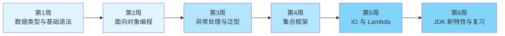

# Java 初学者学习路径

## 路径概览

| 项目 | 说明 |
|------|------|
| 适合人群 | 编程零基础或其他语言转 Java 的开发者 |
| 前置知识 | 基本的计算机操作能力，了解什么是编程 |
| 预计时长 | 4-6 周（每天 2-3 小时） |
| 学习目标 | 掌握 Java 语言基础，能独立编写中小型程序 |

## 学习路线图

## 学习步骤

### 第 1 周：数据类型与基础语法

| 步骤 | 知识点 | 文档链接 | 建议时间 |
|------|--------|----------|----------|
| 1 | 数据类型与包装类 | [数据类型与装箱拆箱](/1-java-core/1.1-java-basics/01-data-types) | 3 小时 |
| 2 | 值传递与引用传递 | [值传递与引用传递](/1-java-core/1.1-java-basics/02-value-passing) | 2 小时 |
| 3 | String 深入理解 | [String 不可变性与 Pool](/1-java-core/1.1-java-basics/03-string-deep-dive) | 3 小时 |

**本周目标**：理解 Java 基本数据类型、自动装箱拆箱机制，掌握值传递的本质，深入理解 String 的不可变性。

### 第 2 周：面向对象编程

| 步骤 | 知识点 | 文档链接 | 建议时间 |
|------|--------|----------|----------|
| 4 | 封装、继承、多态 | [面向对象](/1-java-core/1.1-java-basics/04-oop) | 5 小时 |
| 5 | 注解基础 | [自定义注解与元注解](/1-java-core/1.1-java-basics/09-annotations) | 2 小时 |

**本周目标**：掌握面向对象三大特性，理解内部类、Object 常用方法，了解注解的基本用法。

### 第 3 周：异常处理与泛型

| 步骤 | 知识点 | 文档链接 | 建议时间 |
|------|--------|----------|----------|
| 6 | 异常处理机制 | [异常处理](/1-java-core/1.1-java-basics/06-exceptions) | 3 小时 |
| 7 | 泛型编程 | [泛型与类型擦除](/1-java-core/1.1-java-basics/07-generics) | 4 小时 |
| 8 | 反射机制 | [反射](/1-java-core/1.1-java-basics/08-reflection) | 3 小时 |

**本周目标**：掌握 Checked 与 Unchecked 异常的区别，理解泛型类型擦除原理，学会使用反射操作类信息。

### 第 4 周：集合框架

| 步骤 | 知识点 | 文档链接 | 建议时间 |
|------|--------|----------|----------|
| 9 | 集合框架全览 | [集合框架深入](/1-java-core/1.1-java-basics/05-collections) | 6 小时 |

**本周目标**：掌握 ArrayList、LinkedList、HashMap、TreeMap 等核心集合类的使用和底层原理，了解遍历删除的常见陷阱。

### 第 5 周：IO 与 Lambda

| 步骤 | 知识点 | 文档链接 | 建议时间 |
|------|--------|----------|----------|
| 10 | 文件与流处理 | [IO/NIO/内存映射](/1-java-core/1.1-java-basics/10-io-streams) | 4 小时 |
| 11 | Lambda 与 Stream | [Lambda 与 Stream API](/1-java-core/1.1-java-basics/11-lambda-stream) | 5 小时 |

**本周目标**：掌握 Java IO 和 NIO 的使用，熟练运用 Lambda 表达式和 Stream API 进行函数式编程。

### 第 6 周：JDK 新特性与总复习

| 步骤 | 知识点 | 文档链接 | 建议时间 |
|------|--------|----------|----------|
| 12 | JDK 版本特性演进 | [JDK 8/17/21 新特性](/1-java-core/1.1-java-basics/12-new-features) | 3 小时 |
| 13 | Java 基础面试复习 | [Java 基础面试指南](/1-java-core/1.1-java-basics/99-interview) | 4 小时 |

**本周目标**：了解 JDK 8/17/21 的核心新特性，通过面试题巩固所有基础知识。

## 学习建议

1. 每个知识点都要运行对应的代码示例，动手实践比纯看文档效果好 10 倍
2. 集合框架是面试重中之重，建议多花时间理解 HashMap 的底层原理
3. 遇到不理解的概念先标记，学完后续内容再回头看往往会豁然开朗
4. 建议每周末做一次知识回顾，用自己的话复述核心概念
