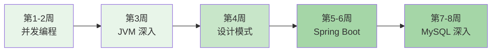

# Java 中级进阶学习路径

## 路径概览

| 项目 | 说明 |
|------|------|
| 适合人群 | 已掌握 Java 基础语法，有 1-2 年开发经验的开发者 |
| 前置知识 | 完成 [Java 初学者路径](/learning-paths/beginner) 或具备同等水平 |
| 预计时长 | 6-8 周（每天 2-3 小时） |
| 学习目标 | 深入理解 Java 底层原理，掌握 Spring Boot 和 MySQL，具备独立开发能力 |

## 学习路线图

## 学习步骤

### 第 1-2 周：并发编程

| 步骤 | 知识点 | 文档链接 | 建议时间 |
|------|--------|----------|----------|
| 1 | 线程生命周期 | [线程生命周期](/1-java-core/1.3-concurrent/01-thread-lifecycle) | 2 小时 |
| 2 | synchronized 原理 | [synchronized 与锁升级](/1-java-core/1.3-concurrent/02-synchronized) | 4 小时 |
| 3 | ReentrantLock 与 AQS | [ReentrantLock/AQS 源码](/1-java-core/1.3-concurrent/03-reentrantlock-aqs) | 4 小时 |
| 4 | volatile 原理 | [volatile 与内存屏障](/1-java-core/1.3-concurrent/04-volatile) | 3 小时 |
| 5 | 线程池原理 | [线程池原理与最佳实践](/1-java-core/1.3-concurrent/05-thread-pool) | 4 小时 |
| 6 | 并发工具类 | [CountDownLatch/CyclicBarrier/Semaphore](/1-java-core/1.3-concurrent/06-concurrent-tools) | 3 小时 |
| 7 | ThreadLocal | [ThreadLocal 与内存泄漏](/1-java-core/1.3-concurrent/07-threadlocal) | 2 小时 |
| 8 | CompletableFuture | [CompletableFuture 异步编程](/1-java-core/1.3-concurrent/08-completable-future) | 3 小时 |
| 9 | CAS 与原子类 | [CAS/原子类/LongAdder](/1-java-core/1.3-concurrent/09-cas-atomic) | 2 小时 |
| 10 | 死锁 | [死锁检测与避免](/1-java-core/1.3-concurrent/10-deadlock) | 2 小时 |

**本阶段目标**：深入理解 Java 并发编程模型，掌握锁机制、线程池、并发工具类的原理和使用。

### 第 3 周：JVM 深入

| 步骤 | 知识点 | 文档链接 | 建议时间 |
|------|--------|----------|----------|
| 11 | 内存模型与内存区域 | [JVM 内存模型](/1-java-core/1.4-jvm/01-memory-model) | 3 小时 |
| 12 | 垃圾回收 | [GC 算法与收集器](/1-java-core/1.4-jvm/02-gc) | 4 小时 |
| 13 | 类加载过程 | [类加载机制](/1-java-core/1.4-jvm/03-classloading) | 2 小时 |
| 14 | JIT 编译 | [JIT 编译与逃逸分析](/1-java-core/1.4-jvm/04-jit) | 2 小时 |
| 15 | JVM 调优 | [JVM 调优参数](/1-java-core/1.4-jvm/05-tuning) | 3 小时 |
| 16 | 诊断工具 | [内存泄漏排查/Arthas](/1-java-core/1.4-jvm/06-diagnostic) | 3 小时 |

**本阶段目标**：理解 JVM 内存模型、GC 机制，掌握常用调优参数和诊断工具。

### 第 4 周：设计模式

| 步骤 | 知识点 | 文档链接 | 建议时间 |
|------|--------|----------|----------|
| 17 | 创建型模式 | [单例/工厂/建造者/原型](/1-java-core/1.5-design-patterns/01-creational) | 3 小时 |
| 18 | 结构型模式 | [代理/适配器/装饰器/门面](/1-java-core/1.5-design-patterns/02-structural) | 3 小时 |
| 19 | 行为型模式 | [策略/模板方法/观察者/责任链](/1-java-core/1.5-design-patterns/03-behavioral) | 3 小时 |
| 20 | Spring 中的设计模式 | [Spring 框架中的设计模式](/1-java-core/1.5-design-patterns/04-spring-patterns) | 2 小时 |
| 21 | 设计原则 | [SOLID/DRY/KISS](/1-java-core/1.5-design-patterns/05-principles) | 2 小时 |

**本阶段目标**：掌握常用设计模式及其在 Spring 框架中的应用，理解 SOLID 设计原则。

### 第 5-6 周：Spring Boot

| 步骤 | 知识点 | 文档链接 | 建议时间 |
|------|--------|----------|----------|
| 22 | IoC 与依赖注入 | [IoC/DI/Bean 生命周期](/2-framework/2.2-springboot/01-ioc-di) | 4 小时 |
| 23 | AOP 原理 | [AOP/事务失效场景](/2-framework/2.2-springboot/02-aop) | 3 小时 |
| 24 | 循环依赖 | [循环依赖三级缓存](/2-framework/2.2-springboot/03-circular-dependency) | 2 小时 |
| 25 | 启动流程 | [启动流程与自动配置](/2-framework/2.2-springboot/04-startup) | 3 小时 |
| 26 | Starter 机制 | [Starter 机制与自定义](/2-framework/2.2-springboot/05-starter) | 2 小时 |
| 27 | 配置文件体系 | [yml/properties/Profile](/2-framework/2.2-springboot/06-config-files) | 2 小时 |
| 28 | Web 开发 | [RESTful/拦截器/全局异常](/2-framework/2.2-springboot/07-web) | 3 小时 |
| 29 | 数据访问 | [JPA/MyBatis/MyBatis-Plus](/2-framework/2.2-springboot/08-data-access) | 4 小时 |
| 30 | 日志体系 | [SLF4J+Logback/MDC](/2-framework/2.2-springboot/10-logging) | 2 小时 |
| 31 | 缓存集成 | [@Cacheable/Redis 缓存](/2-framework/2.2-springboot/11-cache) | 2 小时 |
| 32 | Actuator 监控 | [Actuator 监控与健康检查](/2-framework/2.2-springboot/13-actuator) | 2 小时 |

**本阶段目标**：深入理解 Spring Boot 核心原理（IoC、AOP、自动配置），能独立搭建 Spring Boot 项目。

### 第 7-8 周：MySQL 深入

| 步骤 | 知识点 | 文档链接 | 建议时间 |
|------|--------|----------|----------|
| 33 | 索引原理 | [B+树与索引原理](/3-data-store/3.1-database/01-index-theory) | 4 小时 |
| 34 | 事务与隔离级别 | [事务/隔离级别/MVCC](/3-data-store/3.1-database/02-transaction) | 4 小时 |
| 35 | 锁机制 | [行锁/间隙锁/临键锁](/3-data-store/3.1-database/03-lock) | 3 小时 |
| 36 | SQL 优化 | [SQL 优化/EXPLAIN](/3-data-store/3.1-database/04-optimization) | 3 小时 |
| 37 | 日志系统 | [Redo/Undo Log/Buffer Pool](/3-data-store/3.1-database/07-log-system) | 3 小时 |
| 38 | 连接池 | [HikariCP/Druid](/3-data-store/3.1-database/10-pool) | 2 小时 |
| 39 | 高可用方案 | [主从/MGR/Proxy](/3-data-store/3.1-database/08-high-availability) | 2 小时 |

**本阶段目标**：深入理解 MySQL 索引、事务、锁机制，掌握 SQL 优化和执行计划分析。

## 学习建议

1. 并发编程是面试的重中之重，建议结合代码示例反复练习
2. JVM 调优需要实际操作，建议用 Arthas 工具对自己的项目进行分析
3. 设计模式不要死记硬背，重点理解在 Spring 框架中的实际应用
4. MySQL 的索引和事务是后端面试必考内容，建议多做 EXPLAIN 分析练习
5. 每个模块学完后，做一遍对应的面试指南中的题目进行自测
