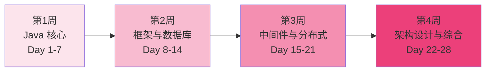

# 面试突击学习路径

## 路径概览

| 项目 | 说明 |
|------|------|
| 适合人群 | 即将参加面试、需要快速复习的 Java 开发者 |
| 前置知识 | 有 1 年以上 Java 开发经验，对各模块有基本了解 |
| 预计时长 | 2-4 周（每天 3-4 小时） |
| 学习目标 | 按面试频率快速过一遍高频知识点，做到心中有数 |

## 学习路线图

## 每日学习计划

### 第 1 周：Java 核心（Day 1-7）

#### Day 1：Java 基础高频题

| 知识点 | 文档链接 | 重点内容 | 时间 |
|--------|----------|----------|------|
| 数据类型 | [数据类型与装箱拆箱](/1-java-core/1.1-java-basics/01-data-types) | Integer 缓存池、自动装箱拆箱 | 30min |
| String | [String 深入](/1-java-core/1.1-java-basics/03-string-deep-dive) | String 不可变性、String Pool、intern | 30min |
| 面向对象 | [面向对象](/1-java-core/1.1-java-basics/04-oop) | equals/hashCode 契约、多态原理 | 1h |
| 面试自测 | [Java 基础面试指南](/1-java-core/1.1-java-basics/99-interview) | 过一遍高频面试题 | 1h |

#### Day 2：集合框架

| 知识点 | 文档链接 | 重点内容 | 时间 |
|--------|----------|----------|------|
| 集合框架 | [集合框架深入](/1-java-core/1.1-java-basics/05-collections) | HashMap 扩容、红黑树转换、ConcurrentHashMap | 2h |
| 集合源码 | [HashMap/ConcurrentHashMap 源码](/1-java-core/1.2-java-advanced/01-collections-source) | put 流程、resize 机制 | 1h |

#### Day 3：并发编程（上）

| 知识点 | 文档链接 | 重点内容 | 时间 |
|--------|----------|----------|------|
| synchronized | [synchronized 与锁升级](/1-java-core/1.3-concurrent/02-synchronized) | 偏向锁→轻量级锁→重量级锁 | 1h |
| volatile | [volatile 与内存屏障](/1-java-core/1.3-concurrent/04-volatile) | 可见性、有序性、happens-before | 45min |
| 线程池 | [线程池原理](/1-java-core/1.3-concurrent/05-thread-pool) | 核心参数、拒绝策略、动态调参 | 1h |

#### Day 4：并发编程（下）

| 知识点 | 文档链接 | 重点内容 | 时间 |
|--------|----------|----------|------|
| AQS | [ReentrantLock/AQS 源码](/1-java-core/1.3-concurrent/03-reentrantlock-aqs) | AQS 核心原理、公平锁/非公平锁 | 1h |
| ThreadLocal | [ThreadLocal 与内存泄漏](/1-java-core/1.3-concurrent/07-threadlocal) | 内存泄漏原因、最佳实践 | 30min |
| CAS | [CAS/原子类](/1-java-core/1.3-concurrent/09-cas-atomic) | CAS 原理、ABA 问题 | 30min |
| 面试自测 | [并发编程面试指南](/1-java-core/1.3-concurrent/99-interview) | 过一遍高频面试题 | 1h |

#### Day 5：JVM

| 知识点 | 文档链接 | 重点内容 | 时间 |
|--------|----------|----------|------|
| 内存模型 | [JVM 内存模型](/1-java-core/1.4-jvm/01-memory-model) | 堆/栈/方法区、内存溢出场景 | 1h |
| GC | [GC 算法与收集器](/1-java-core/1.4-jvm/02-gc) | CMS/G1/ZGC 对比、GC 调优 | 1.5h |
| 类加载 | [类加载机制](/1-java-core/1.4-jvm/03-classloading) | 双亲委派、打破双亲委派 | 30min |
| 面试自测 | [JVM 面试指南](/1-java-core/1.4-jvm/99-interview) | 过一遍高频面试题 | 30min |

#### Day 6：设计模式 + Java 进阶

| 知识点 | 文档链接 | 重点内容 | 时间 |
|--------|----------|----------|------|
| 创建型模式 | [单例/工厂/建造者](/1-java-core/1.5-design-patterns/01-creational) | 单例的 5 种写法、工厂模式 | 1h |
| Spring 中的模式 | [Spring 中的设计模式](/1-java-core/1.5-design-patterns/04-spring-patterns) | 工厂/代理/模板方法/观察者 | 30min |
| 动态代理 | [JDK/CGLIB 代理](/1-java-core/1.2-java-advanced/03-dynamic-proxy) | JDK 代理 vs CGLIB 区别 | 30min |
| JMM | [JMM/happens-before](/1-java-core/1.2-java-advanced/07-jmm) | happens-before 规则 | 30min |

#### Day 7：网络与协议

| 知识点 | 文档链接 | 重点内容 | 时间 |
|--------|----------|----------|------|
| TCP/IP | [TCP/IP 协议栈](/2-framework/2.1-network/01-tcp-ip) | 三次握手、四次挥手 | 1h |
| HTTP | [HTTP/HTTPS](/2-framework/2.1-network/02-http) | HTTP/1.1 vs 2 vs 3、HTTPS 握手 | 1h |
| 网络安全 | [XSS/CSRF/SQL 注入](/2-framework/2.1-network/05-security) | 常见攻击与防护 | 30min |

### 第 2 周：框架与数据库（Day 8-14）

#### Day 8：Spring Boot 核心（上）

| 知识点 | 文档链接 | 重点内容 | 时间 |
|--------|----------|----------|------|
| IoC/DI | [IoC/DI/Bean 生命周期](/2-framework/2.2-springboot/01-ioc-di) | Bean 生命周期、三级缓存 | 1.5h |
| AOP | [AOP/事务失效场景](/2-framework/2.2-springboot/02-aop) | 动态代理实现、事务失效 8 大场景 | 1h |
| 循环依赖 | [循环依赖三级缓存](/2-framework/2.2-springboot/03-circular-dependency) | 三级缓存解决原理 | 30min |

#### Day 9：Spring Boot 核心（下）

| 知识点 | 文档链接 | 重点内容 | 时间 |
|--------|----------|----------|------|
| 启动流程 | [启动流程与自动配置](/2-framework/2.2-springboot/04-startup) | SpringApplication.run 全过程 | 1h |
| Starter | [Starter 机制](/2-framework/2.2-springboot/05-starter) | 自动配置原理、自定义 Starter | 30min |
| 面试自测 | [Spring Boot 面试指南](/2-framework/2.2-springboot/99-interview) | 过一遍高频面试题 | 1.5h |

#### Day 10：MySQL 索引与事务

| 知识点 | 文档链接 | 重点内容 | 时间 |
|--------|----------|----------|------|
| 索引原理 | [B+树与索引原理](/3-data-store/3.1-database/01-index-theory) | B+树结构、索引失效场景 | 1.5h |
| 事务 | [事务/隔离级别/MVCC](/3-data-store/3.1-database/02-transaction) | 四种隔离级别、MVCC 实现 | 1.5h |

#### Day 11：MySQL 锁与优化

| 知识点 | 文档链接 | 重点内容 | 时间 |
|--------|----------|----------|------|
| 锁机制 | [行锁/间隙锁/临键锁](/3-data-store/3.1-database/03-lock) | 锁类型、加锁规则 | 1h |
| SQL 优化 | [SQL 优化/EXPLAIN](/3-data-store/3.1-database/04-optimization) | EXPLAIN 字段含义、优化技巧 | 1h |
| 日志系统 | [Redo/Undo Log](/3-data-store/3.1-database/07-log-system) | WAL 机制、两阶段提交 | 30min |
| 面试自测 | [数据库面试指南](/3-data-store/3.1-database/99-interview) | 过一遍高频面试题 | 30min |

#### Day 12：Redis（上）

| 知识点 | 文档链接 | 重点内容 | 时间 |
|--------|----------|----------|------|
| 数据结构 | [数据结构与底层实现](/3-data-store/3.2-redis/01-data-structures) | 5 种基本类型 + 底层编码 | 1.5h |
| 持久化 | [RDB/AOF 持久化](/3-data-store/3.2-redis/02-persistence) | RDB vs AOF 对比 | 30min |
| 集群 | [主从/哨兵/Cluster](/3-data-store/3.2-redis/03-replication) | 三种部署模式对比 | 1h |

#### Day 13：Redis（下）

| 知识点 | 文档链接 | 重点内容 | 时间 |
|--------|----------|----------|------|
| 缓存问题 | [穿透/击穿/雪崩](/3-data-store/3.2-redis/04-cache-problems) | 三大问题解决方案 | 1h |
| 分布式锁 | [Redis 分布式锁](/3-data-store/3.2-redis/05-distributed-lock) | Redisson 实现、RedLock | 1h |
| 面试自测 | [Redis 面试指南](/3-data-store/3.2-redis/99-interview) | 过一遍高频面试题 | 1h |

#### Day 14：消息队列

| 知识点 | 文档链接 | 重点内容 | 时间 |
|--------|----------|----------|------|
| RabbitMQ | [RabbitMQ 核心概念](/4-middleware/4.1-mq-rabbitmq/01-rabbitmq) | Exchange 类型、消息模型 | 1h |
| RabbitMQ 可靠性 | [消息可靠性/幂等性](/4-middleware/4.1-mq-rabbitmq/02-rabbitmq-reliability) | 消息确认、幂等性保证 | 30min |
| Kafka | [Kafka 架构与原理](/4-middleware/4.2-mq-kafka/01-kafka) | 分区、副本、ISR | 1h |
| Kafka 可靠性 | [消息可靠性/顺序性](/4-middleware/4.2-mq-kafka/02-kafka-reliability) | acks 配置、顺序消费 | 30min |

### 第 3 周：中间件与分布式（Day 15-21）

#### Day 15：Spring Cloud（上）

| 知识点 | 文档链接 | 重点内容 | 时间 |
|--------|----------|----------|------|
| 服务注册发现 | [服务注册与发现](/2-framework/2.3-springcloud/01-registry) | Consul/Nacos/Eureka 对比 | 1h |
| 负载均衡 | [Ribbon/LoadBalancer](/2-framework/2.3-springcloud/02-loadbalancer) | 负载均衡策略 | 30min |
| OpenFeign | [OpenFeign/超时重试](/2-framework/2.3-springcloud/03-feign) | 声明式调用、超时配置 | 30min |
| 熔断降级 | [Sentinel/Resilience4j](/2-framework/2.3-springcloud/04-circuit-breaker) | 熔断器原理、降级策略 | 1h |

#### Day 16：Spring Cloud（下）

| 知识点 | 文档链接 | 重点内容 | 时间 |
|--------|----------|----------|------|
| 网关 | [Gateway 路由/过滤器](/2-framework/2.3-springcloud/05-gateway) | 路由配置、全局过滤器 | 1h |
| 链路追踪 | [Sleuth/Zipkin](/2-framework/2.3-springcloud/07-tracing) | TraceId 透传、日志关联 | 30min |
| 分布式事务 | [Seata AT/TCC](/2-framework/2.3-springcloud/08-transaction) | AT 模式原理 | 30min |
| 面试自测 | [Spring Cloud 面试指南](/2-framework/2.3-springcloud/99-interview) | 过一遍高频面试题 | 1h |

#### Day 17：注册中心与配置中心

| 知识点 | 文档链接 | 重点内容 | 时间 |
|--------|----------|----------|------|
| Consul | [Consul 架构/健康检查](/4-middleware/4.5-registry/02-consul) | Consul 核心特性 | 1h |
| 注册中心对比 | [注册中心选型对比表](/4-middleware/4.5-registry/05-comparison) | CAP 视角对比 | 30min |
| Apollo | [Apollo 架构/热更新](/4-middleware/4.4-config-center/01-apollo) | 配置热更新原理 | 1h |
| 配置中心对比 | [Apollo vs Nacos](/4-middleware/4.4-config-center/03-comparison) | 选型建议 | 30min |

#### Day 18：分布式理论（上）

| 知识点 | 文档链接 | 重点内容 | 时间 |
|--------|----------|----------|------|
| CAP/BASE | [CAP 与 BASE 理论](/5-distributed/5.1-distributed/01-cap-base) | CAP 不可能三角、BASE 思想 | 1h |
| 一致性算法 | [Raft/Paxos 算法](/5-distributed/5.1-distributed/02-consensus) | Raft 选举过程 | 1h |
| 分布式锁 | [Redis/ZK/MySQL 分布式锁](/5-distributed/5.1-distributed/03-distributed-lock) | 三种方案对比 | 1h |

#### Day 19：分布式理论（下）

| 知识点 | 文档链接 | 重点内容 | 时间 |
|--------|----------|----------|------|
| 分布式事务 | [2PC/TCC/Saga](/5-distributed/5.1-distributed/04-distributed-transaction) | 各方案优缺点对比 | 1h |
| 幂等性 | [幂等性设计](/5-distributed/5.1-distributed/05-idempotent) | 幂等性实现方案 | 30min |
| 限流算法 | [令牌桶/漏桶/滑动窗口](/5-distributed/5.1-distributed/06-rate-limiting) | 三种算法对比 | 30min |
| 面试自测 | [分布式面试指南](/5-distributed/5.1-distributed/99-interview) | 过一遍高频面试题 | 1h |

#### Day 20：Elasticsearch

| 知识点 | 文档链接 | 重点内容 | 时间 |
|--------|----------|----------|------|
| 倒排索引 | [倒排索引原理](/3-data-store/3.3-elasticsearch/01-inverted-index) | 倒排索引结构 | 1h |
| DSL 查询 | [DSL 复合查询](/3-data-store/3.3-elasticsearch/04-dsl-query) | bool/match/term 查询 | 1h |
| Spring 集成 | [Spring Data ES](/3-data-store/3.3-elasticsearch/06-spring-data) | Repository 使用 | 30min |

#### Day 21：Nginx + Linux

| 知识点 | 文档链接 | 重点内容 | 时间 |
|--------|----------|----------|------|
| Nginx 架构 | [Master-Worker 模型](/4-middleware/4.6-nginx/01-architecture) | 工作原理 | 30min |
| 反向代理 | [反向代理配置](/4-middleware/4.6-nginx/02-reverse-proxy) | 反向代理 vs 正向代理 | 30min |
| 负载均衡 | [负载均衡策略](/4-middleware/4.6-nginx/03-load-balance) | 4 种策略对比 | 30min |
| JVM 排查 | [CPU 飙高/OOM/死锁排查](/6-devops/6.4-linux/05-jvm-troubleshooting) | 线上问题排查流程 | 1h |
| Linux 命令 | [常用命令速查](/6-devops/6.4-linux/01-commands) | 高频命令 | 30min |

### 第 4 周：架构设计与综合（Day 22-28）

#### Day 22：Docker/K8s

| 知识点 | 文档链接 | 重点内容 | 时间 |
|--------|----------|----------|------|
| Docker 基础 | [镜像/容器/仓库](/6-devops/6.1-docker-k8s/01-docker-basics) | 核心概念 | 1h |
| Dockerfile | [多阶段构建](/6-devops/6.1-docker-k8s/02-dockerfile) | 最佳实践 | 30min |
| K8s 架构 | [K8s 核心组件](/6-devops/6.1-docker-k8s/06-k8s-architecture) | Master/Node 架构 | 1h |
| K8s 资源 | [Pod/Deployment/Service](/6-devops/6.1-docker-k8s/07-k8s-resources) | 核心资源对象 | 30min |

#### Day 23：架构设计 - 秒杀与缓存

| 知识点 | 文档链接 | 重点内容 | 时间 |
|--------|----------|----------|------|
| 秒杀系统 | [秒杀系统设计](/8-architecture/01-seckill) | 限流/库存扣减/异步下单 | 1.5h |
| 缓存方案 | [分布式缓存方案](/8-architecture/04-cache-strategy) | 多级缓存架构 | 1h |
| 缓存一致性 | [缓存与 DB 双写一致性](/8-architecture/08-cache-db-consistency) | 延迟双删、Canal 方案 | 1h |

#### Day 24：架构设计 - 订单与幂等

| 知识点 | 文档链接 | 重点内容 | 时间 |
|--------|----------|----------|------|
| 订单超时 | [订单超时取消方案](/8-architecture/03-order-timeout) | 延迟队列/定时任务 | 1h |
| 幂等性方案 | [接口幂等性设计](/8-architecture/05-idempotent-design) | Token/唯一索引/状态机 | 1h |
| 分布式 Session | [分布式 Session](/8-architecture/06-distributed-session) | Redis/JWT/Spring Session | 30min |

#### Day 25：架构设计 - 短链接与文件上传

| 知识点 | 文档链接 | 重点内容 | 时间 |
|--------|----------|----------|------|
| 短链接系统 | [短链接系统设计](/8-architecture/02-short-url) | 哈希/自增 ID/Base62 | 1h |
| 大文件上传 | [大文件上传方案](/8-architecture/07-file-upload) | 分片/断点续传 | 1h |
| 分布式 ID | [雪花算法/Leaf](/3-data-store/3.1-database/09-distributed-id) | 分布式 ID 生成方案 | 30min |

#### Day 26：数据库进阶 + 分库分表

| 知识点 | 文档链接 | 重点内容 | 时间 |
|--------|----------|----------|------|
| 分库分表 | [分库分表/ShardingSphere](/3-data-store/3.1-database/05-sharding) | 分片策略、数据迁移 | 1.5h |
| Binlog | [Binlog/Canal/主从同步](/3-data-store/3.1-database/06-binlog) | Binlog 格式、Canal 使用 | 1h |

#### Day 27：AI + 算法高频题

| 知识点 | 文档链接 | 重点内容 | 时间 |
|--------|----------|----------|------|
| Spring AI | [Spring AI 框架](/7-ai/7.1-ai/01-spring-ai) | Spring AI 基本使用 | 30min |
| 排序算法 | [快排/归并/堆排序](/1-java-core/1.6-algorithm/06-sorting) | 时间复杂度对比 | 30min |
| 链表 | [反转链表/合并/环形检测](/1-java-core/1.6-algorithm/01-linked-list) | 高频链表题 | 30min |
| 动态规划 | [爬楼梯/LIS/背包](/1-java-core/1.6-algorithm/09-dynamic-programming) | DP 解题模板 | 1h |

#### Day 28：全面复习与模拟面试

| 知识点 | 文档链接 | 重点内容 | 时间 |
|--------|----------|----------|------|
| 面试知识图谱 | [面试知识图谱](/interview/knowledge-map) | 全局知识关联 | 1h |
| 按公司分类 | [按公司类型面试重点](/interview/by-company) | 针对目标公司复习 | 1h |
| 架构设计面试 | [架构设计面试指南](/8-architecture/99-interview) | 系统设计题总结 | 1h |

## 学习建议

1. 面试突击重在"广度"而非"深度"，每个知识点抓住核心要点即可
2. 重点关注面试指南中标注为"高频"的题目
3. 每天学完后用自己的话复述 3-5 个核心概念，模拟面试回答
4. 如果时间紧张（2 周），优先完成 Day 1-14 的内容，覆盖最高频考点
5. 建议找朋友进行模拟面试，练习表达能力和临场反应
