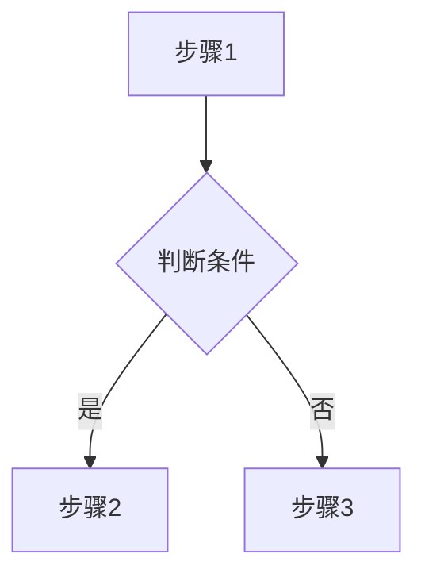

# [知识点标题]

## 概念说明

<!-- 用通俗易懂的语言解释这个知识点是什么、解决什么问题 -->

[在此填写概念说明]

## 核心原理

<!-- 深入分析底层原理，配合图表说明 -->

[在此填写核心原理]

<!-- 如果涉及复杂流程，必须包含 Mermaid 流程图或时序图 -->



## 代码示例

<!-- 关键代码片段 + 指向 code-examples 中完整可运行代码的链接 -->

```java
// 在此填写关键代码片段
```

> 💻 完整可运行代码：[code-examples/模块名/路径](链接)
>
> ⚠️ 每个知识点必须有对应的可运行代码示例

## 常见面试题

### Q1: [面试题目]

**难度**：⭐⭐⭐ | **频率**：🔥🔥🔥

**答题思路**：

<!-- 分步骤的答题思路 -->

1. [步骤1]
2. [步骤2]
3. [步骤3]

**标准答案**：

[在此填写完整答案]

**深入追问**：

- [追问1]
- [追问2]

**易错点**：

- [易错点1]
- [易错点2]

### Q2: [面试题目]

**难度**：⭐⭐ | **频率**：🔥🔥

**答题思路**：

[在此填写答题思路]

**标准答案**：

[在此填写完整答案]

## 参考资料

- [资料名称1](链接)
- [资料名称2](链接)
